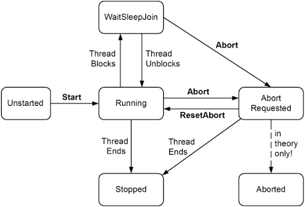

# 1.1 Thread 基础

### 导读

本篇是《多线程入门和实践(初级)》的第一篇，也是大家相当熟悉和不屑的的最简单的入门部分。作为系列文章，笔者将从最简单的部分开始，与各位伙伴一起不断学习和探究 C# 中的多线程。

对于涉及理论的东西，这里不会过多讨论。更加深入的成分会在中级系列加以说明和探讨，届时会有很多与底层相关的知识。

<p>
    <blockquote style="margin: 10px 0px; padding: 10px; border-left: 4px solid rgb(221, 221, 221); color: rgb(68, 68, 68); background-color: rgb(249, 249, 249); border-radius: 4px; font-size: 14px; overflow-wrap: break-word; font-family: "Helvetica Neue", 微软雅黑, "Microsoft Yahei", Helvetica, Arial, sans-serif               ">
系列文章一般开头都要写一些寄语吧？<br />
&nbsp; &nbsp; &nbsp; &nbsp; &nbsp; 那我祝愿各位同学要好好学习，天天向上。
    </blockquote>
</p>


学习多线程的第一步，就是学习 Thread。Thread 类可以创建和控制线程，设置其优先级并获取其状态。这一篇将开始学习线程的创建和生命周期。

官方文档 Thread 类详细的属性和方法：

[https://docs.microsoft.com/zh-cn/dotnet/api/system.threading.thread?view=netcore-3.1#properties](https://docs.microsoft.com/zh-cn/dotnet/api/system.threading.thread?view=netcore-3.1#properties)


来，打开你的 `Visual Studio`，一起撸代码。


## 1，获取当前线程信息

`Thread.CurrentThread` 是一个 静态的 Thread 类，Thread 的`CurrentThread` 属性，可以获取到当前运行线程的一些信息，其定义如下：

```C#
public static System.Threading.Thread CurrentThread { get; }
```


Thread 类有很多属性和方法，这里就不列举了，后面的学习会慢慢熟悉更多 API 和深入了解使用。

这里有一个简单的示例：

```c#
        static void Main(string[] args)
        {
            Thread thread = new Thread(OneTest);
            thread.Name = "Test";
            thread.Start();
            Console.ReadKey();
        }

        public static void OneTest()
        {
            Thread thisTHread = Thread.CurrentThread;
            Console.WriteLine("线程标识：" + thisTHread.Name);
            Console.WriteLine("当前地域：" + thisTHread.CurrentCulture.Name);  // 当前地域
            Console.WriteLine("线程执行状态：" + thisTHread.IsAlive);
            Console.WriteLine("是否为后台线程：" + thisTHread.IsBackground);
            Console.WriteLine("是否为线程池线程"+thisTHread.IsThreadPoolThread);
        }
```


输出

```
线程标识：Test
当前地域：zh-CN
线程执行状态：True
是否为后台线程：False
是否为线程池线程False

```


## 2，管理线程状态

一般认为，线程有五种状态：

新建(new 对象) 、就绪(等待CPU调度)、运行(CPU正在运行)、阻塞(等待阻塞、同步阻塞等)、死亡(对象释放)。



理论的东西不说太多，直接撸代码。


### 【2.1】启动与参数传递

新建线程简直滚瓜烂熟，无非 `new` 一下，然后 `Start()`。

```csharp
Thread thread = new Thread(); 
```


Thread 的构造函数有四个：

```c#
public Thread(ParameterizedThreadStart start);

public Thread(ThreadStart start);

public Thread(ParameterizedThreadStart start, int maxStackSize);

public Thread(ThreadStart start, int maxStackSize);
```

我们以启动新的线程时传递参数来举例，使用这四个构造函数呢？


#### 【2.1.1】ParameterizedThreadStart

ParameterizedThreadStart 是一个委托，构造函数传递的参数为需要执行的方法，然后在 `Start` 方法中传递参数。

需要注意的是，传递的参数类型为 object，而且只能传递一个。

代码示例如下：

```c#
        static void Main(string[] args)
        {
            string myParam = "abcdef";
            ParameterizedThreadStart parameterized = new ParameterizedThreadStart(OneTest);
            Thread thread = new Thread(parameterized);
            thread.Start(myParam);
            Console.ReadKey();
        }

        public static void OneTest(object obj)
        {
            string str = obj as string;
            if (string.IsNullOrEmpty(str))
                return;

            Console.WriteLine("新的线程已经启动");
            Console.WriteLine(str);
        }
```


#### 【2.1.2】使用静态变量或类成员变量

此种方法不需要作为参数传递，各个线程共享堆栈。

优点是不需要装箱拆箱，多线程可以共享空间；缺点是变量是大家都可以访问，此种方式在多线程竞价时，可能会导致多种问题(可以加锁解决)。

下面使用两个变量实现数据传递：

```c#
    class Program
    {
        private string A = "成员变量";
        public static string B = "静态变量";

        static void Main(string[] args)
        {
            // 创建一个类
            Program p = new Program();

            Thread thread1 = new Thread(p.OneTest1);
            thread1.Name = "Test1";
            thread1.Start();

            Thread thread2 = new Thread(OneTest2);
            thread2.Name = "Test2";
            thread2.Start();

            Console.ReadKey();
        }

        public void OneTest1()
        {
            Console.WriteLine("新的线程已经启动");
            Console.WriteLine(A);       // 本身对象的其它成员
        }
        public static void OneTest2()
        {
            Console.WriteLine("新的线程已经启动");
            Console.WriteLine(B);       // 全局静态变量
        }
    }
```


#### 【2.1.3】委托与Lambda

原理是 Thread 的构造函数 `public Thread(ThreadStart start);`，`ThreadStart ` 是一个委托，其定义如下

```csharp
public delegate void ThreadStart();
```

使用委托的话，可以这样写

```C#
        static void Main(string[] args)
        {
            System.Threading.ThreadStart start = DelegateThread;

            Thread thread = new Thread(start);
            thread.Name = "Test";
            thread.Start();


            Console.ReadKey();
        }

        public static void DelegateThread()
        {
            OneTest("a", "b", 666, new Program());
        }
        public static void OneTest(string a, string b, int c, Program p)
        {
            Console.WriteLine("新的线程已经启动");
        }
```

有那么一点点麻烦，不过我们可以使用 Lambda 快速实现。

使用 Lambda 示例如下：

```c#
        static void Main(string[] args)
        {
            Thread thread = new Thread(() =>
            {
                OneTest("a", "b", 666, new Program());
            });
            thread.Name = "Test";
            thread.Start();
            
            Console.ReadKey();
        }

        public static void OneTest(string a, string b, int c, Program p)
        {
            Console.WriteLine("新的线程已经启动");
        }
```

<p>
    <div style="color: rgb(23, 23, 23); font-family: &quot;Segoe UI&quot;, SegoeUI, &quot;Segoe WP&quot;, &quot;Helvetica Neue&quot;, Helvetica, Tahoma, Arial, sans-serif; background-color: rgb(255, 241, 204);border-radius: 10px;padding:20px;">
	提示：如果需要处理的算法比较简单的话，可以直接写进委托中，不需要另外写方法啦。
</div>
</p>

可以看到，C# 是多么的方便。


### 【2.2】暂停与阻塞

`Thread.Sleep()` 方法可以将当前线程挂起一段时间，`Thread.Join()` 方法可以阻塞当前线程一直等待另一个线程运行至结束。

在等待线程 `Sleep()` 或 `Join()` 的过程中，线程是阻塞的(Blocket)。

<p>    <blockquote style="margin: 10px 0px; padding: 10px; border-left: 4px solid rgb(221, 221, 221); color: rgb(68, 68, 68); background-color: rgb(249, 249, 249); border-radius: 4px; font-size: 14px; overflow-wrap: break-word; font-family: "Helvetica Neue", 微软雅黑, "Microsoft Yahei", Helvetica, Arial, sans-serif;">  
    &nbsp; &nbsp; 阻塞的定义：当线程由于特点原因暂停执行，那么它就是阻塞的。
    <br />&nbsp; &nbsp; 如果线程处于阻塞状态，线程就会交出他的 CPU 时间片，并且不会消耗 CPU 时间，直至阻塞结束。
     <br />&nbsp; &nbsp; 阻塞会发生上下文切换。
</blockquote></p>

代码示例如下：

```C#
        static void Main(string[] args)
        {
            Thread thread = new Thread(OneTest);
            thread.Name = "小弟弟";

            Console.WriteLine($"{DateTime.Now}:大家在吃饭，吃完饭后要带小弟弟逛街");
            Console.WriteLine("吃完饭了");
            Console.WriteLine($"{DateTime.Now}:小弟弟开始玩游戏");
            thread.Start();

            // 化妆 5 s
            Console.WriteLine("不管他，大姐姐化妆先"); Thread.Sleep(TimeSpan.FromSeconds(5));

            Console.WriteLine($"{DateTime.Now}:化完妆，等小弟弟打完游戏");
            thread.Join();

            Console.WriteLine("打完游戏了嘛？" + (!thread.IsAlive ? "true" : "false"));
            Console.WriteLine($"{DateTime.Now}:走，逛街去");
            Console.ReadKey();
        }

        public static void OneTest()
        {
            Console.WriteLine(Thread.CurrentThread.Name + "开始打游戏");
            for (int i = 0; i < 10; i++)
            {
                Console.WriteLine($"{DateTime.Now}:第几局：" + i);
                Thread.Sleep(TimeSpan.FromSeconds(2));      // 休眠 2 秒
            }
            Console.WriteLine(Thread.CurrentThread.Name + "打完了");
        }
```

<p>
    <div style="color: rgb(23, 23, 23); font-family: &quot;Segoe UI&quot;, SegoeUI, &quot;Segoe WP&quot;, &quot;Helvetica Neue&quot;, Helvetica, Tahoma, Arial, sans-serif; background-color: rgb(255, 241, 204);border-radius: 10px;padding:20px;">
	Join() 也可以实现简单的线程同步，即一个线程等待另一个线程完成。
</div>
</p>


### 【2.3】线程状态

`ThreadState` 是一个枚举，记录了线程的状态，我们可以从中判断线程的生命周期和健康情况。

其枚举如下：

| 枚举        | 值   | 说明                                                         |
| ----------- | ---- | ------------------------------------------------------------ |
| Initialized | 0    | 此状态指示线程已初始化但尚未启动。                           |
| Ready       | 1    | 此状态指示线程因无可用的处理器而等待使用处理器。 线程准备在下一个可用的处理器上运行。 |
| Running     | 2    | 此状态指示线程当前正在使用处理器。                           |
| Standby     | 3    | 此状态指示线程将要使用处理器。 一次只能有一个线程处于此状态。 |
| Terminated  | 4    | 此状态指示线程已完成执行并已退出。                           |
| Transition  | 6    | 此状态指示线程在可以执行前等待处理器之外的资源。 例如，它可能正在等待其执行堆栈从磁盘中分页。 |
| Unknown     | 7    | 线程的状态未知。                                             |
| Wait        | 5    | 此状态指示线程尚未准备好使用处理器，因为它正在等待外围操作完成或等待资源释放。 当线程就绪后，将对其进行重排。 |

但是里面有很多枚举类型是没有用处的，我们可以使用一个这样的方法来获取更加有用的信息：

```c#
        public static ThreadState GetThreadState(ThreadState ts)
        {
            return ts & (ThreadState.Unstarted |
                ThreadState.WaitSleepJoin |
                ThreadState.Stopped);
        }
```

<p>
    <div style="color: rgb(23, 23, 23); font-family: &quot;Segoe UI&quot;, SegoeUI, &quot;Segoe WP&quot;, &quot;Helvetica Neue&quot;, Helvetica, Tahoma, Arial, sans-serif; background-color: rgb(255, 241, 204);border-radius: 10px;padding:20px;">
	此方法来自：《C# 7.0 核心技术指南》第十四章。
</div>
</p>

根据 **2.2** 中的示例，我们修改一下 Main 中的方法：

```c#
        static void Main(string[] args)
        {
            Thread thread = new Thread(OneTest);
            thread.Name = "小弟弟";

            Console.WriteLine($"{DateTime.Now}:大家在吃饭，吃完饭后要带小弟弟逛街");
            Console.WriteLine("吃完饭了");
            Console.WriteLine($"{DateTime.Now}:小弟弟开始玩游戏");
            Console.WriteLine("弟弟在干嘛？(线程状态)：" + Enum.GetName(typeof(ThreadState), GetThreadState(thread.ThreadState)));
            thread.Start();
            Console.WriteLine("弟弟在干嘛？(线程状态)：" + Enum.GetName(typeof(ThreadState), GetThreadState(thread.ThreadState)));
            // 化妆 5 s
            Console.WriteLine("不管他，大姐姐化妆先"); Thread.Sleep(TimeSpan.FromSeconds(5));
            Console.WriteLine("弟弟在干嘛？(线程状态)：" + Enum.GetName(typeof(ThreadState), GetThreadState(thread.ThreadState)));
            Console.WriteLine($"{DateTime.Now}:化完妆，等小弟弟打完游戏");
            thread.Join();
            Console.WriteLine("弟弟在干嘛？(线程状态)：" + Enum.GetName(typeof(ThreadState), GetThreadState(thread.ThreadState)));
            Console.WriteLine("打完游戏了嘛？" + (!thread.IsAlive ? "true" : "false"));
            Console.WriteLine($"{DateTime.Now}:走，逛街去");
            Console.ReadKey();
        }
```

代码看着比较乱，请复制到项目中运行一下。

输出示例：

```
2020/4/11 11:01:48:大家在吃饭，吃完饭后要带小弟弟逛街
吃完饭了
2020/4/11 11:01:48:小弟弟开始玩游戏
弟弟在干嘛？(线程状态)：Unstarted
弟弟在干嘛？(线程状态)：Running
不管他，大姐姐化妆先
小弟弟开始打游戏
2020/4/11 11:01:48:第几局：0
2020/4/11 11:01:50:第几局：1
2020/4/11 11:01:52:第几局：2
弟弟在干嘛？(线程状态)：WaitSleepJoin
2020/4/11 11:01:53:化完妆，等小弟弟打完游戏
2020/4/11 11:01:54:第几局：3
2020/4/11 11:01:56:第几局：4
2020/4/11 11:01:58:第几局：5
2020/4/11 11:02:00:第几局：6
2020/4/11 11:02:02:第几局：7
2020/4/11 11:02:04:第几局：8
2020/4/11 11:02:06:第几局：9
小弟弟打完了
弟弟在干嘛？(线程状态)：Stopped
打完游戏了嘛？true
2020/4/11 11:02:08:走，逛街去

```

可以看到 `Unstarted`、`WaitSleepJoin`、`Running`、`Stopped`四种状态，即未开始（就绪）、阻塞、运行中、死亡。


### 【2.4】终止

`.Abort()` 方法不能在 .NET Core 上使用，不然会出现 `System.PlatformNotSupportedException:“Thread abort is not supported on this platform.”` 。

后面关于异步的文章会讲解如何实现终止。

由于 .NET Core 不支持，就不理会这两个方法了。这里只列出 API，不做示例。

| 方法          | 说明                                                         |
| ------------- | ------------------------------------------------------------ |
| Abort()       | 在调用此方法的线程上引发 ThreadAbortException，以开始终止此线程的过程。 调用此方法通常会终止线程。 |
| Abort(Object) | 引发在其上调用的线程中的 ThreadAbortException以开始处理终止线程，同时提供有关线程终止的异常信息。 调用此方法通常会终止线程。 |

`Abort()` 方法给线程注入 `ThreadAbortException` 异常，导致程序被终止。但是**不一定可以终止线程**。


### 【2.5】线程的不确定性

线程的不确定性是指几个并行运行的线程，不确定 CPU 时间片会分配给谁(当然，分配有优先级)。

对我们来说，多线程是`同时运行`的，但一般 CPU 没有那么多核，不可能在同一时刻执行所有的线程。CPU 会决定某个时刻将时间片分配给多个线程中的一个线程，这就出现了 CPU 的时间片分配调度。

执行下面的代码示例，你可以看到，两个线程打印的顺序是不确定的，而且每次运行结果都不同。

CPU 有一套公式确定下一次时间片分配给谁，但是比较复杂，需要学习计算机组成原理和操作系统。

留着下次写文章再讲。

```c#
        static void Main(string[] args)
        {
            Thread thread1 = new Thread(Test1);
            Thread thread2 = new Thread(Test2);

            thread1.Start();
            thread2.Start();

            Console.ReadKey();
        }

        public static void Test1()
        {
            for (int i = 0; i < 10; i++)
            {
                Console.WriteLine("Test1:" + i);
            }
        }
        public static void Test2()
        {
            for (int i = 0; i < 10; i++)
            {
                Console.WriteLine("Test2:" + i);
            }
        }
```


### 【2.6】线程优先级、前台线程和后台线程

`Thread.Priority` 属性用于设置线程的优先级，`Priority` 是一个 ThreadPriority  枚举，其枚举类型如下

| 枚举        | 值   | 说明                                                         |
| ----------- | ---- | ------------------------------------------------------------ |
| AboveNormal | 3    | 可以将 安排在具有 `Highest` 优先级的线程之后，在具有 `Normal` 优先级的线程之前。 |
| BelowNormal | 1    | 可以将 Thread 安排在具有 `Normal` 优先级的线程之后，在具有 `Lowest` 优先级的线程之前。 |
| Highest     | 4    | 可以将 Thread 安排在具有任何其他优先级的线程之前。           |
| Lowest      | 0    | 可以将 Thread 安排在具有任何其他优先级的线程之后。           |
| Normal      | 2    | 可以将 Thread 安排在具有 `AboveNormal` 优先级的线程之后，在具有 `BelowNormal` 优先级的线程之前。 默认情况下，线程具有 `Normal` 优先级。 |

优先级排序：`Highest` > `AboveNormal` > `Normal` > `BelowNormal` > `Lowest`。


`Thread.IsBackgroundThread` 可以设置线程是否为后台线程。

前台线程的优先级大于后台线程，并且程序需要等待所有前台线程执行完毕后才能关闭；而当程序关闭是，无论后台线程是否在执行，都会强制退出。


### 【2.7】自旋和休眠

当线程处于进入休眠状态或解除休眠状态时，会发生上下文切换，这就带来了昂贵的消耗。

而线程不断运行，就会消耗 CPU 时间，占用 CPU 资源。


对于过短的等待，应该使用自旋(spin)方法，避免发生上下文切换；过长的等待应该使线程休眠，避免占用大量 CPU 时间。

我们可以使用最为熟知的 `Sleep()` 方法休眠线程。有很多同步线程的类型，也使用了休眠手段等待线程（已经写好草稿啦）。


自旋的意思是，没事找事做。

例如：

```csharp
        public static void Test(int n)
        {
            int num = 0;
            for (int i=0;i<n;i++)
            {
                num += 1;
            }
        }
```

通过做一些简单的运算，来消耗时间，从而达到等待的目的。

C# 中有关于自旋的自旋锁和 `Thread.SpinWait();` 方法，在后面的线程同步分类中会说到自旋锁。

`Thread.SpinWait()` 在极少数情况下，避免线程使用上下文切换很有用。其定义如下

```csharp
public static void SpinWait(int iterations);
```

SpinWait 实质上是（处理器）使用了非常紧密的循环，并使用 `iterations` 参数指定的循环计数。 SpinWait 等待时间取决于处理器的速度。

<p>
    <div style="color: rgb(23, 23, 23); font-family: &quot;Segoe UI&quot;, SegoeUI, &quot;Segoe WP&quot;, &quot;Helvetica Neue&quot;, Helvetica, Tahoma, Arial, sans-serif; background-color: rgb(255, 241, 204);border-radius: 10px;padding:20px;">
	SpinWait 无法使你准确控制等待时间，主要是使用一些锁时用到，例如 Monitor.Enter。 
</div>
</p>

