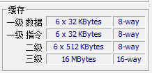
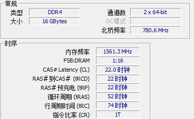

# 1.2 .NET 多线程模型

在第一章中，我们学习了 Thread 类，它是 C# 使用多线程能力的基础，在本章笔者将会从源码角度中解析 C# 的 Thread，而多线程编程属于并发编程，会涉及到很多中断、同步问题如锁、内存屏障等，而本章内容主要帮助读者了解操作系统和 .NET CLR 中的一些知识，便于理解更多细节以及为后面的章节阅读打下基础。


### 并发编程

**并发跟并行不一样**。并行是真正多核同时运行，多个事件在同一时刻发生；而并发是多个事件在同一个时间间隔内发生，在多线程编程中，我们往往会留意到线程会发生上下文切换。在 .NET 中，有 TPL、Parallel、PLinq 库提供并行编程，而在本章中，讨论的是并发编程。


《深入理解计算机系统》的 12章中，列举了并发编程的一些场景：

* **访问慢速 I/O 设备**。当一个应用程序正在等待来着慢速 I/O 设备（如磁盘）的数据到达时，内核会运行其它进程，使 CPU 保持繁忙。每个应用都可以按照类似的方式，通过交替执行 I/O 请求和其他有用的工作来利用并发。

* **与人交互**。和计算机交互的人要求计算机有同时执行多个任务的能力。例如，他们在打印一个文档时，可能想要调整一个窗口的大小。现代视窗系统利用并发来提供这种能力。每次用户请求某种操作（比如通过单击鼠标）时，一个独立的并发逻辑流被创建来执行这个操作。

* **通过推迟工作以降低延迟**。有时，应用程序能够通过推迟其他操作和并发地执行它们，利用并发来降低某些操作的延迟。比如，一个动态内存分配器可以通过推迟合并，把它放到一个运行在较低优先级上的并发“合并”流中，在有空闲的CPU周期时充分利用这些空闲周期，从而降低单个 free 操作的延迟。

* **服务多个网络客户端**。可能期望它每秒为成百上千的客户端提供服务，由于一个慢速客户端导致拒绝为其他客户端服务，这是不能接受一个更好的方法是创建一个并发服务器，它为每个客户端创建一个单独的逻辑这就允许服务器同时为多个客户端服务，并且也避免了慢速客户端独占服务器。

* **在多核机器上进行并行计算**。许多现代系统都配备多核处理器，多核处理器中包含有多个 CPU。被划分成并发流的应用程序通常在多核机器上比在单处理器机器上运行得快，因为这些流会并行执行，而不是交错执行。

> 这部分内容来自中文翻译书，可能不太通顺。


而在现代操作系统中，提供了三种并发编程模型：

* 进程。进程有操作系统管理，每个进程执行一类任务，多个进程并发运行，提示完成多个任务。
* I/O 多路复用。如 Linux 的 epoll。
* 线程。通用方法。


本系列文章中，主要关注多线程并发编程模型。接下来，我们将使用 C 语言，通过线程并发模型，来编写一个具有并发能力的程序。通过这个示例代码，在我们了解 CLR 线程代码时，加深理解。


### 并发编程模型：线程

每个进程开始生命周期时都是单一的线程，这个线程称为主线程，在主线程中可以创建新的线程，于是这些线程与主线程一起并发运行。

线程就是运行在进程上下文中的逻辑流。每个线程都有它自己的**线程上下文**，**包括线程 ID、栈、栈指针、程序计数器、通用目的寄存器和条件码**，进程中的线程共享该进程的整个虚拟地址空间(虚拟内存)。


虽然线程比进程廉价，但是发生线程上下文切换时，CPU 会挂起当前线程转而执行其它线程，要先保存原线程的栈、寄存器等，接着加载新的线程的上下文。在这个上下文切换中，是需要消耗时间的，频繁的线程上下文切换，会导致浪费大量性能。而且线程的创建和消耗都需要消耗系统资源，频繁创建线程会导致系统资源消耗过多，当线程数量太多时，线程切换上下文的次数也会变多，消耗大量的  CPU。同时，线程上下文切换会导致 CPU 缓存失效以及命中率降低，执行效率变低。


### CPU 缓存结构

这里聊一下 CPU 的缓存结构，这对帮助我们了解后面的并发编程等有好处。

现代 CPU 的高速缓冲存储器一般分为三个级别 L1、L2、L3。


【图来自小林《图解操作系统》】


每个 CPU 核心内部都会有一个 L1 Cache 和 L2 Cache，而所有 CPU 核心共享一个 L3 Cache。

其中， L1 Cache 分为**数据缓存和指令缓存**。

在 Windows 中，可以通过任务管理器查看每级高速缓冲存储器已用空间。


在 Linux 中，我们也可以通过命令查看一个核心中 L1 Cache 的数据缓存和指令缓存空间大小：

```bash
whuanle@whuanle-PC:~$ ls /sys/devices/system/cpu/
cpu0  cpu10  cpu2  cpu4  cpu6  cpu8  cpufreq  hotplug   kernel_max  offline  possible  smt     vulnerabilities
cpu1  cpu11  cpu3  cpu5  cpu7  cpu9  cpuidle  isolated  modalias    online   present   uevent
whuanle@whuanle-PC:~$ cat /sys/devices/system/cpu/cpu0/cache/index0/size
32K
whuanle@whuanle-PC:~$ cat /sys/devices/system/cpu/cpu0/cache/index1/size
32K
```

查看 L2 Cache 大小：

```bash
whuanle@whuanle-PC:~$ cat /sys/devices/system/cpu/cpu0/cache/index2/size
512K
```

查看 L3 Cache 大小：

```bash
whuanle@whuanle-PC:~$ cat /sys/devices/system/cpu/cpu0/cache/index3/size
16384K
```




> **[info]** 提示
>
> ```
> L1：index0、index1，数据缓存和指令缓存
> 
> L2：index2
> 
> L3：index3
> ```


如果 CPU 0 核心把一个变量从内存加载到 L3 - L2 - L1 ，然后通过计算，要把值写回内存，而此时 CPU 1 也需要使用到这个变量，发现 L3 已经有了，直接从 L3 中加载，而 CPU 0 计算完成后，把这变量的值覆盖了，接着 CPU 1 又覆盖一次。这样就会导致不一致。C# 中的多线程编程，最简单的是使用 lock 加锁，但是在 CPU 中，要协调多处理器读取同一个变量，则会变得很复杂。


高速缓冲存储器的分级机制有利于 CPU 提前加载内存中的指令和数据，以及对要执行的指令进行预测，前面说到，频繁进行线程上下文切换，会导致缓存失效， CPU 需要频繁从内存中加载数据和指令到高速缓冲存储器。L1 的速度大约是 2-4 个时钟周期，而 L2 则是 10-20 个时钟周期，L3 是 20-60 个时钟周期，而内存(这里只指DRAM)则可能要上百个时钟周期。



注：笔者的内存是 PCIe® 3.0 DDR4，速度快。PCIe 2.0 或 DDR3 内存条会更加慢。


### 创建线程

下面是一份 C 语言的代码，使用 Posix 标准的线程库，可以运行在 Unix 类系统 下，通过 Posix，我们可以使用 pthread 来使用创建线程，下面是一个简单的示例：

```c
#include "pthread.h"

void* thread(void* vargp)
{
	printf("Hello, world!\n");
	return NULL;
}

int main()
{
	// typedef unsigned long int pthread_t;
	pthread_t tid;
	Pthread_create(&tid, NULL, thread, NULL);		// 创建线程并获得线程的 id
	Pthread_join(tid, NULL);						// mian 阻塞等待 这个线程完成
	exit(0);
}

/*
extern int pthread_create (pthread_t *__restrict __newthread,
			   const pthread_attr_t *__restrict __attr,
			   void *(*__start_routine) (void *),
			   void *__restrict __arg) __THROWNL __nonnull ((1, 3));
*/
```


在很多书籍中，都会讨论到用户空间线程、内核线程、轻量级进程，在新版本的 Linux 内核中，通过 pthread 创建的线程都是内核线程，而这里我们不必想得太复杂，我们可以把使用线程库创建的线程称为原生线程，由操作系统管理。在 Windows 的任务管理器中，便可以看到原生线程的数量。


pthread.h 头文件中，包含了如下功能：

- 线程管理，例如创建线程，等待(join)线程，查询线程状态等。
- 互斥锁（Mutex）：创建、摧毁、锁定、解锁、设置属性等操作
- 条件变量（Condition Variable）：创建、摧毁、等待、通知、设置与查询属性等操作
- 使用了互斥锁的线程间的同步管理


### CLR 的线程是如何创建的

在 C# 中创建一个线程很简单：

```csharp
        Thread thread = new Thread(() => { });
```


在 C# 中创建 Thread 对象是一种轻量级操作，当 `new Thread` 时，只是创建了一个 Thread，此时并不会实际创建一个操作系统线程。**只有使用 `thread.Start();` 时，才会创建一个真正的操作系统线程**。

在 `new Thread` 时，CLR 会调用一个 `Initialize` 方法初始化一个 C++ Thread 对象。


在执行 `SetupUnstartedThread` 时，会创建一个 C++ Thread 对象，并放到 C++ ThreadStore 中，由 ThreadStore 管理 CLR 中的 Thread 对象。这个过程主要为一些字段或属性赋予初始值。`pThis->SetManagedThreadId(unstarted->GetThreadId());` 可以为当前线程生成一个 Id 值。


一般来说，C# 线程对应的操作系统线程 Id 是不可获取的，但是你可以通过反射获取 CLR 线程对应操作系统线程的 Id：

```csharp
    static void Main(string[] args)
    {
        var property = typeof(Thread).GetProperty("CurrentOSThreadId", BindingFlags.NonPublic | BindingFlags.Static);
        var id = property.GetValue(null);
        Console.WriteLine(id);
    }
```


当使用 `thread.Start()` 时，将真正开始创建一个对应的操作系统线程。从 C# 代码到 CLR 的 C++ 代码中，需要调用多个函数才能完成创建流程。

具体的创建流程如下所示：


当执行到 `CreateNewOsThread` 函数时，开始真正创建一个操作系统线程。


首先检查要设置的线程栈空间大小。如果 sizeToCommitOrReserve 是默认值，则使用 `GetDefaultStackSizeSetting()` 方法获取一个线程的栈空间大小。


```c
SIZE_T GetDefaultStackSizeSetting()
{
    static DWORD s_defaultStackSizeEnv = CLRConfig::GetConfigValue(CLRConfig::INTERNAL_DefaultStackSize);

    uint64_t value = s_defaultStackSizeEnv ? s_defaultStackSizeEnv : s_defaultStackSizeProperty;

    SIZE_T minStack = 0x10000;     // 64K - Somewhat arbitrary minimum thread stack size
    SIZE_T maxStack = 0x80000000;  //  2G - Somewhat arbitrary maximum thread stack size

    if ((value >= maxStack) || ((value != 0) && (value < minStack)))
    {
        ThrowHR(E_INVALIDARG);
    }

    return (SIZE_T) value;
}
```

可知，如果有配置过 appsettings.json 等 程序启动配置文件，那么 GC 会中根据配置文件设置栈大小，当然 CLR 对线程栈空间大小的默认值是 1MB。如果发现程序的 CLR 配置线程栈空间太小或太大(64k-2G)，那么就会使用默认值来设置栈大小。


而在 Unix 下，还要考虑栈空间大小与内存分页页面大小，如果空间大小小于内存页大小，那么与内存页大小为准。

```c

uint32_t GetOsPageSize()
{
#ifdef HOST_UNIX
    size_t result = g_pageSize.LoadWithoutBarrier();

    if(!result)
    {
        result = GetOsPageSizeUncached();

        g_pageSize.StoreWithoutBarrier(result);
    }

    return result;
#else
    return 0x1000;
#endif
}
```

> **[info]** 提示
>
> 默认线程的栈空间的大小为 1MB。我们可以通过在 `new Thread()` 时设置 `maxStackSize` 。
>
> 在 Linux 中，你可以通过以下命令获取内存页大小。
>
> ```
> root@whuanle-PC:~# getconf PAGE_SIZE
> 4096
> ```


当线程配置准备完成后，CLR 开始真正创建线程，每种操作系统创建的方式不一样。

CLR 中关于创建线程的代码如下：

```c
#ifdef TARGET_UNIX
    h = ::PAL_CreateThread64(NULL     /*=SECURITY_ATTRIBUTES*/,
#else
    h = ::CreateThread(      NULL     /*=SECURITY_ATTRIBUTES*/,
#endif
                             sizeToCommitOrReserve,
                             start,
                             args,
                             dwCreationFlags,
                             &ourId);
```

下图中，左边是 Windows 的代码，右边是 Linux 代码。


在 Windows 下，使用 `processthreadsapi.h`，请参考：https://docs.microsoft.com/zh-cn/windows/win32/api/processthreadsapi/nf-processthreadsapi-createthread

在 Linux 下，使用 pthread，请参考：https://zh.wikipedia.org/wiki/POSIX%E7%BA%BF%E7%A8%8B


可以看到，Linux 创建线程的方式跟笔者前面使用 C 语言创建线程的方式一样的。这里我们不需要关心 pthread 、kthread 的用户线程和内核线程问题，我们只需要知道 CLR 创建的线程，是可以被操作系统识别的，即原生线程。


通过这些步骤，你应该意识到 C# 中的线程与操作系统线程是一对一的关系。同时你也了解到，创建一个 Thread，需要这么多步骤，而且消耗类系统资源，因此在 .NET 并发编程中，我们要避免直接创建线程，而应该多使用线程池线程或 Task，避免创建和回收线程的开销。

