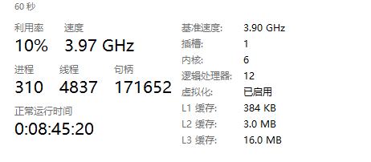
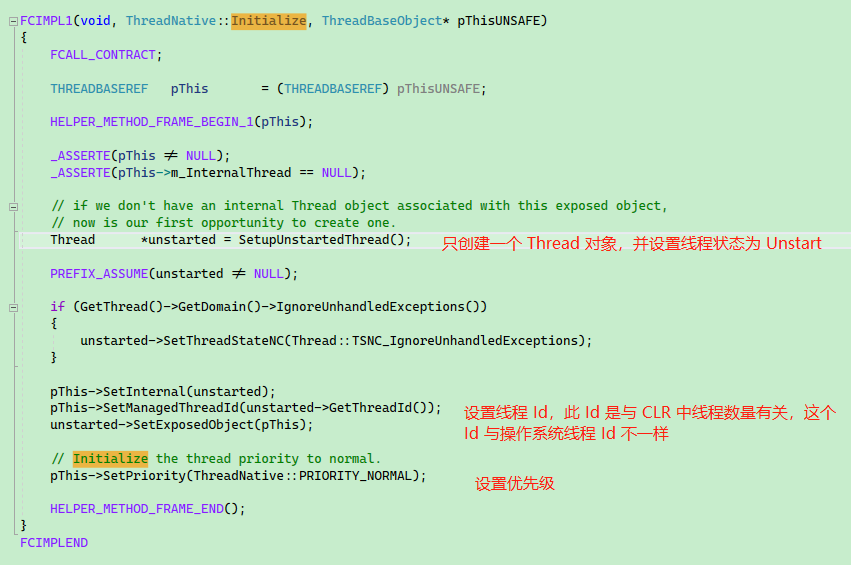
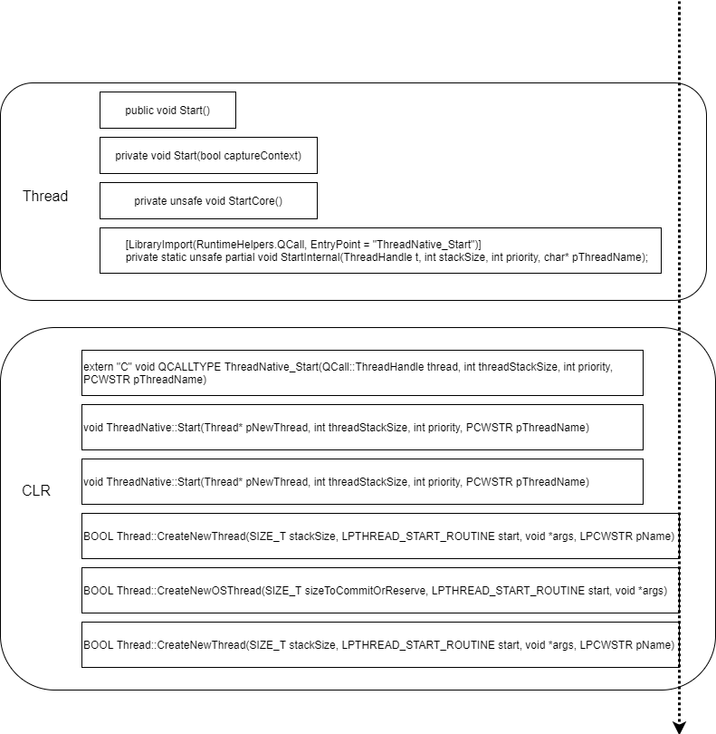
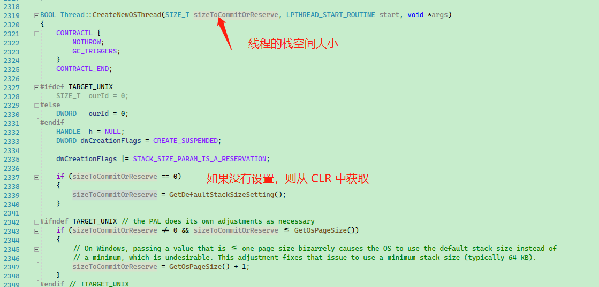
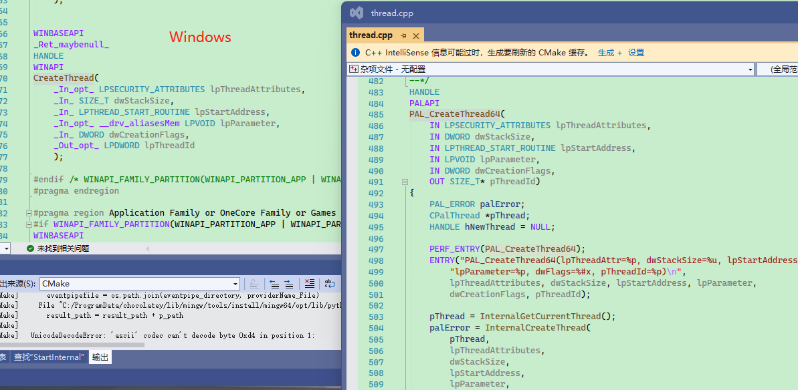

# 1.2 .NET 多线程模型

在第一章中，我们学习了 Thread 类，它是 C# 使用多线程能力的基础，在本章笔者将会从源码中解析 C# 的 Thread，而多线程编程属于并发编程，会涉及到很多中断、同步问题如锁、内存屏障等，而本章内容主要帮助读者了解操作系统和 .NET CLR 中的一些知识，便于理解更多细节以及为后面的章节阅读打下基础。


## 并发编程

并发跟并行不一样。并行是真正多核同时运行，多个事件在同一时刻发生；而并发是多个事件在同一个时间间隔内发生。在 .NET 中，有 TPL、Parallel、PLinq 库提供并行编程，而在本章中，讨论的是并发编程。

《深入理解计算机系统》的 12章中，列举了并发编程的一些场景：

* **访问慢速 I/O 设备**。当一个应用程序正在等待来着慢速 I/O 设备（如磁盘）的数据到达时，内核会运行其它进程，使 CPU 保持繁忙。每个应用都可以按照类似的方式，通过交替执行 I/O 请求和其他有用的工作来利用并发。

* **与人交互**。和计算机交互的人要求计算机有同时执行多个任务的能力。例如，他们在打印一个文档时，可能想要调整一个窗口的大小。现代视窗系统利用并发来提供这种能力。每次用户请求某种操作（比如通过单击鼠标）时，一个独立的并发逻辑流被创建来执行这个操作。

* **通过推迟工作以降低延迟**。有时，应用程序能够通过推迟其他操作和并发地执行它们，利用并发来降低某些操作的延迟。比如，一个动态内存分配器可以通过推迟合并，把它放到一个运行在较低优先级上的并发“合并”流中，在有空闲的CPU周期时充分利用这些空闲周期，从而降低单个 free 操作的延迟。

* **服务多个网络客户端**。可能期望它每秒为成百上千的客户端提供服务，由于一个慢速客户端导致拒绝为其他客户端服务，这是不能接受一个更好的方法是创建一个并发服务器，它为每个客户端创建一个单独的逻辑这就允许服务器同时为多个客户端服务，并且也避免了慢速客户端独占服务器。

* **在多核机器上进行并行计算**。许多现代系统都配备多核处理器，多核处理器中包含有多个 CPU。被划分成并发流的应用程序通常在多核机器上比在单处理器机器上运行得快，因为这些流会并行执行，而不是交错执行。

> 这部分内容来自中文版书里面，可能不太通顺。


而在现代操作系统中，提供了三种并发编程模型：

* 进程
* I/O 多路复用
* 线程


接下来，我们将使用 C 语言，通过线程并发模型，来编写一个具有并发能力的程序。


### 并发编程模型：线程

线程(Thread) 就是运行在进程上下文中的逻辑流。每个线程都有它自己的**线程上下文**，包**括线程 ID、栈、栈指针、程序计数器、通用目的寄存器和条件码**，进程中的线程共享该进程的整个虚拟地址空间(虚拟内存)。

每个进程开始生命周期时都是单一的线程，这个线程称为主线程，在主线程中可以创建新的线程，于是这些线程与主线程一起并发运行。

我们都知道线程时间片用完时，CPU 会挂起当前线程转而执行其它线程，在切换线程时，线程的上下文也会被切换，会保存好旧线程的上下文，然后就加载新的线程的上下文。在这个上下文切换中，是需要消耗时间的，频繁的线程上下文切换，会导致浪费大量性能。同时，线程上下文切换会导致 CPU 缓存失效以及命中率降低，执行效率变低。


### CPU 缓存结构

这里聊一下 CPU 的缓存结构，这对帮助我们了解后面的并发编程等有好处。

现代 CPU 的高速缓冲存储器一般分为三个级别 L1、L2、L3。


【图来自小林《图解操作系统》】


每个 CPU 核心都会有一个 L1 Cache 和 L2 Cache，而所有 CPU 核心共享一个 L3 Cache。

其中， L1 Cache 分为数据缓存和指令缓存。

在 Windows 中，可以通过任务管理器查看每级高速缓冲存储器已用空间。



在 Linux 中，我们也可以通过命令查看一个核心中 L1 Cache 的数据缓存和指令缓存空间大小：

```bash
whuanle@whuanle-PC:~$ ls /sys/devices/system/cpu/
cpu0  cpu10  cpu2  cpu4  cpu6  cpu8  cpufreq  hotplug   kernel_max  offline  possible  smt     vulnerabilities
cpu1  cpu11  cpu3  cpu5  cpu7  cpu9  cpuidle  isolated  modalias    online   present   uevent
whuanle@whuanle-PC:~$ cat /sys/devices/system/cpu/cpu0/cache/index0/size
32K
whuanle@whuanle-PC:~$ cat /sys/devices/system/cpu/cpu0/cache/index1/size
32K
```

查看 L2 Cache 大小：

```bash
whuanle@whuanle-PC:~$ cat /sys/devices/system/cpu/cpu0/cache/index2/size
512K
```

查看 L3 Cache 大小：

```bash
whuanle@whuanle-PC:~$ cat /sys/devices/system/cpu/cpu0/cache/index3/size
16384K
```


> **[info]** 提示
>
> ```
> L1：index0、index1，数据缓存和指令缓存
> 
> L2：index2
> 
> L3：index3
> ```


### 创建线程

在 Linux 下，我们可以使用 pthread 来使用多线程，下面是一个

```c
#include "pthread.h"

void* thread(void* vargp)
{
	printf("Hello, world!\n");
	return NULL;
}

int main()
{
	// typedef unsigned long int pthread_t;
	pthread_t tid;
	Pthread_create(&tid, NULL, thread, NULL);
	Pthread_join(tid, NULL);
	exit(0);
}

/*
extern int pthread_create (pthread_t *__restrict __newthread,
			   const pthread_attr_t *__restrict __attr,
			   void *(*__start_routine) (void *),
			   void *__restrict __arg) __THROWNL __nonnull ((1, 3));
*/
```


在新版本的 Linux 内核中，通过 pthread 创建的线程都是内核线程

- 线程管理，例如创建线程，等待(join)线程，查询线程状态等。
- [互斥锁](https://zh.wikipedia.org/wiki/互斥锁)（Mutex）：创建、摧毁、锁定、解锁、设置属性等操作
- [条件变量](https://zh.wikipedia.org/wiki/条件变量)（Condition Variable）：创建、摧毁、等待、通知、设置与查询属性等操作
- 使用了互斥锁的线程间的[同步](https://zh.wikipedia.org/wiki/同步_(计算机科学))管理


### CLR 的线程是如何创建的

```
        Thread thread = new Thread(() => { });
```

创建 Thread 对象是轻量级操作，并不会实际创建一个操作系统线程。

当 `new Thread` 时，只是创建了一个 Thread，没有真正创建线程。




在执行 `SetupUnstartedThread` 时，会创建一个 C++ Thread 对象，并放到 C++ ThreadStore 中，由 ThreadStore 管理 CLR 中的 Thread 对象。

只有使用 `thread.Start();` 时，才会创建一个真正的操作系统线程

获取 CLR 线程对应操作系统线程的 Id：

```csharp
    static void Main(string[] args)
    {
        var property = typeof(Thread).GetProperty("CurrentOSThreadId", BindingFlags.NonPublic | BindingFlags.Static);
        var id = property.GetValue(null);
        Console.WriteLine(id);
    }
```





首先检查要设置的线程栈空间大小。




Windows：

```c
SIZE_T GetDefaultStackSizeSetting()
{
    static DWORD s_defaultStackSizeEnv = CLRConfig::GetConfigValue(CLRConfig::INTERNAL_DefaultStackSize);

    uint64_t value = s_defaultStackSizeEnv ? s_defaultStackSizeEnv : s_defaultStackSizeProperty;

    SIZE_T minStack = 0x10000;     // 64K - Somewhat arbitrary minimum thread stack size
    SIZE_T maxStack = 0x80000000;  //  2G - Somewhat arbitrary maximum thread stack size

    if ((value >= maxStack) || ((value != 0) && (value < minStack)))
    {
        ThrowHR(E_INVALIDARG);
    }

    return (SIZE_T) value;
}
```

Unix：

```c

uint32_t GetOsPageSize()
{
#ifdef HOST_UNIX
    size_t result = g_pageSize.LoadWithoutBarrier();

    if(!result)
    {
        result = GetOsPageSizeUncached();

        g_pageSize.StoreWithoutBarrier(result);
    }

    return result;
#else
    return 0x1000;
#endif
}
```

> root@whuanle-PC:~# getconf PAGE_SIZE
> 4096

> 
>
> **[info]** 默认线程的栈空间的大小为 1MB。我们可以通过在 `new Thread()` 时设置 `maxStackSize` 。


真正创建线程

```c
#ifdef TARGET_UNIX
    h = ::PAL_CreateThread64(NULL     /*=SECURITY_ATTRIBUTES*/,
#else
    h = ::CreateThread(      NULL     /*=SECURITY_ATTRIBUTES*/,
#endif
                             sizeToCommitOrReserve,
                             start,
                             args,
                             dwCreationFlags,
                             &ourId);
```





在 Windows 下，使用 `processthreadsapi.h`：https://docs.microsoft.com/zh-cn/windows/win32/api/processthreadsapi/nf-processthreadsapi-createthread

在 Linux 下，使用 pthread：https://zh.wikipedia.org/wiki/POSIX%E7%BA%BF%E7%A8%8B


C# 中的线程与操作系统线程是一对一的关系。

