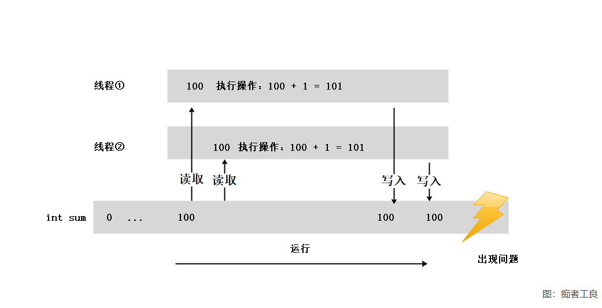
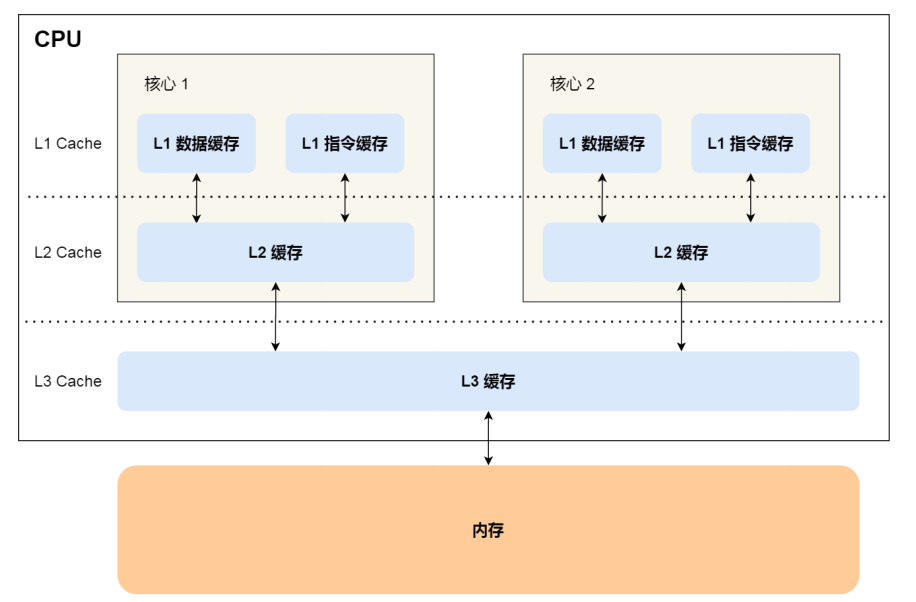
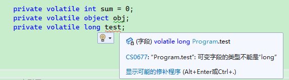
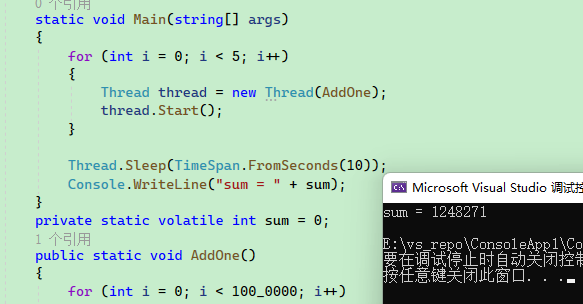

# 2.1 原子操作

### 导读

本章主要讲述多线程竞争下的原子操作。

在 1.2 章节的线程模型中，我们了解到了 CPU 缓存机制，在本章中需要应用到这些知识。


## 知识点

### 竞争条件

当两个或两个以上的线程访问共享数据，并且尝试同时改变它时，就会发生争用的情况。它们所依赖的那部分共享数据，叫做竞争条件。

数据争用是竞争条件中的一种，出现竞争条件可能会导致内存(数据)损坏或者出现不确定性的行为。

在操作系统中，会学到临界资源、临界区之类的知识，这里就不提了，只涉及 .NET 部分的概念。


### 线程同步

如果有 N 个线程都会执行某个操作，当一个线程正在执行这个操作时，其它线程都必须依次等待，这就是线程同步。

多线程环境下出现竞争条件，通常是没有执行正确的同步而导致的。


### CPU时间片和上下文切换

时间片(timeslice)是操作系统分配给每个正在运行的进程微观上的一段 CPU 时间。

<p>
    <blockquote style="margin: 10px 0px; padding: 10px; border-left: 4px solid rgb(221, 221, 221); color: rgb(68, 68, 68); background-color: rgb(249, 249, 249); border-radius: 4px; font-size: 14px; overflow-wrap: break-word; font-family: "Helvetica Neue", 微软雅黑, "Microsoft Yahei", Helvetica, Arial, sans-serif">
首先，内核会给每个进程分配相等的初始时间片，然后每个进程轮番地执行相应的时间，当所有进程都处于时间	片耗尽的状态时，内核会重新为每个进程计算并分配时间片，如此往复。
    </blockquote>
</p>

请参考：[https://zh.wikipedia.org/wiki/%E6%97%B6%E9%97%B4%E7%89%87](https://zh.wikipedia.org/wiki/时间片)


上下文切换（Context Switch），也称做进程切换或任务切换，是指 CPU 从一个进程或线程切换到另一个进程或线程。

<p>
    <blockquote style="margin: 10px 0px; padding: 10px; border-left: 4px solid rgb(221, 221, 221); color: rgb(68, 68, 68); background-color: rgb(249, 249, 249); border-radius: 4px; font-size: 14px; overflow-wrap: break-word; font-family: "Helvetica Neue", 微软雅黑, "Microsoft Yahei", Helvetica, Arial, sans-serif">
在接受到中断（Interrupt）的时候，CPU 必须要进行上下文交换。进行上下文切换时，会带来性能损失。
    </blockquote>
</p>


请参考[[https://zh.wikipedia.org/wiki/上下文交換](https://zh.wikipedia.org/wiki/上下文交換)

### 阻塞

阻塞状态指线程处于等待状态。当线程处于阻塞状态时，会尽可能少占用 CPU 时间。

当线程从运行状态(Runing)变为阻塞状态时(WaitSleepJoin)，操作系统就会将此线程占用的 CPU 时间片分配给别的线程。当线程恢复运行状态时(Runing)，操作系统会重新分配 CPU 时间片。

分配 CPU 时间片时，会出现上下文切换。


### 内核模式和用户模式

只有操作系统才能切换线程、挂起线程，因此阻塞线程是由操作系统处理的，这种方式被称为内核模式(kernel-mode)。

`Sleep()`、`Join()` 等，都是使用内核模式来阻塞线程，实现线程同步(等待)。

<p>
     <div style="color: rgb(23, 23, 23); font-family: &quot;Segoe UI&quot;, SegoeUI, &quot;Segoe WP&quot;, &quot;Helvetica Neue&quot;, Helvetica, Tahoma, Arial, sans-serif; background-color: rgb(255, 241, 204);border-radius: 10px;padding:20px;">
内核模式实现线程等待时，出现上下文切换。这适合等待时间比较长的操作，这样会减少大量的 CPU 时间损耗。
</div>   
</p>

如果线程只需要等待非常微小的时间，阻塞线程带来的上下文切换代价会比较大，这时我们可以使用**自旋**，来实现线程同步，这一方法称为用户模式(user-mode)。


## Interlocked 类

Interlocked 为多个线程共享的变量提供原子操作。

使用 Interlocked 类 避免竞争条件，可以在不阻塞线程(lock、Monitor)的情况下，对目标对象做修改。


Interlocked 类是静态类，让我们先来看看 Interlocked 的常用方法：

| 方法              | 作用                                                         |
| ----------------- | ------------------------------------------------------------ |
| CompareExchange() | 比较两个数是否相等，如果相等，则替换第一个值。               |
| Decrement()       | 以原子操作的形式递减指定变量的值并存储结果。                 |
| Exchange()        | 以原子操作的形式，设置为指定的值并返回原始值。               |
| Increment()       | 以原子操作的形式递增指定变量的值并存储结果。                 |
| Add()             | 对两个数进行求和并用和替换第一个整数，上述操作作为一个原子操作完成。 |
| Read()            | 返回一个以原子操作形式加载的值。                             |

全部方法请查看：[https://docs.microsoft.com/zh-cn/dotnet/api/system.threading.interlocked?view=netcore-3.1#methods](https://docs.microsoft.com/zh-cn/dotnet/api/system.threading.interlocked?view=netcore-3.1#methods)


### 1，CPU 缓存问题

问题：

​		C# 中赋值和一些简单的数学运算不是原子操作，受多线程环境影响，可能会出现问题。

我们可以使用 lock 和 Monitor 来解决这些问题，但是还有没有更加简单的方法呢？

首先我们编写以下代码：

```csharrp
        private static int sum = 0;
        public static void AddOne()
        {
            for (int i = 0; i < 100_0000; i++)
            {
                sum += 1;
            }
        }
```

这个方法的工作完成后，sum 会 +100。

我们在 Main 方法中调用：

```csharrp
        static void Main(string[] args)
        {
            AddOne();
            AddOne();
            AddOne();
            AddOne();
            AddOne();
            Console.WriteLine("sum = " + sum);
        }
```

结果肯定是 5000000，无可争议的。

但是这样会慢一些，如果作死，要多线程同时执行呢？

好的，Main 方法改成如下：

```csharrp
        static void Main(string[] args)
        {
            for (int i = 0; i < 5; i++)
            {
                Thread thread = new Thread(AddOne);
                thread.Start();
            }

            Thread.Sleep(TimeSpan.FromSeconds(2));
            Console.WriteLine("sum = " + sum);
        }
```


笔者运行一次，出现了 `sum = 2633938`

我们将每次运算的结果保存到数组中，截取其中一段发现：

```
8757
8758
8760
8760
8760
8761
8762
8763
8764
8765
8766
8766
8768
8769
```

多个线程使用同一个变量进行操作时，并不知道此变量已经在其它线程中发生改变，导致执行完毕后结果不符合期望。

我们可以通过下面这张图来解释：



操作值类型时，其内存位置的值会被复制到 CPU 缓存中，例如 CPU1 将 sum 值复制到 L2 中，CPU1 还没有将计算后的结果放到 L3，  CPU2 读取了一个旧值，即 CPU2 发生脏读，此时 CPU1、CPU2 操作的 `int sum` 导致数据混乱。




因此，这里就需要原子操作，在某个时刻，必须只有一个线程能够进行某个操作。而上面的操作，指的是读取、计算、写入这一过程。

当然，我们可以使用 lock 或者 Monitor 来解决，但是这样会带来比较大的性能损失。

这时 Interlocked 就起作用了，对于一些简单的操作运算， Interlocked 可以实现原子性的操作。

<p>
     <div style="color: rgb(23, 23, 23); font-family: &quot;Segoe UI&quot;, SegoeUI, &quot;Segoe WP&quot;, &quot;Helvetica Neue&quot;, Helvetica, Tahoma, Arial, sans-serif; background-color: rgb(255, 241, 204);border-radius: 10px;padding:20px;">
实现原子性，可以通过多种锁来解决，目前我们学习到了 lock、Monitor，现在来学习 Interlocked ，后面会学到更加多的锁的实现。
</div>   
</p>


### 2，Interlocked.Increment()

用于自增操作。

我们修改一下 AddOne 方法：

```csharrp
        public static void AddOne()
        {
            for (int i = 0; i < 100_0000; i++)
            {
                Interlocked.Increment(ref sum);
            }
        }
```

然后运行，你会发现结果 sum = 5000000 ，这就对了。

说明 Interlocked 可以对简单值类型进行原子操作。

<p>
    <blockquote style="margin: 10px 0px; padding: 10px; border-left: 4px solid rgb(221, 221, 221); color: rgb(68, 68, 68); background-color: rgb(249, 249, 249); border-radius: 4px; font-size: 14px; overflow-wrap: break-word; font-family: "Helvetica Neue", 微软雅黑, "Microsoft Yahei", Helvetica, Arial, sans-serif">
        <code>Interlocked.Increment()</code> 是递增，而 <code>Interlocked.Decrement()</code> 是递减。
    </blockquote>
</p>


### 3，Interlocked.Exchange()

`Interlocked.Exchange()` 实现赋值运算。

这个方法有多个重载，我们找其中一个来看看：

```csharrp
public static int Exchange(ref int location1, int value);
```

意思是将 value 赋给 location1 ，然后返回 location1 改变之前的值。

测试：

```csharp
        static void Main(string[] args)
        {
            int a = 1;
            int b = 5;

            // a 改变前为1
            int result1 = Interlocked.Exchange(ref a, 2);

            Console.WriteLine($"a新的值 a = {a}   |  a改变前的值 result1 = {result1}");

            Console.WriteLine();

            // a 改变前为 2，b 为 5
            int result2 = Interlocked.Exchange(ref a, b);

            Console.WriteLine($"a新的值 a = {a}   | b不会变化的  b = {b}   |   a 之前的值  result2 = {result2}");
        }
```


另外 `Exchange()` 也有对引用类型的重载：

```csharp
Exchange<T>(T, T)
```


### 4，Interlocked.CompareExchange()

其中一个重载：

```csharp
public static int CompareExchange (ref int location1, int value, int comparand)
```

比较两个 32 位有符号整数是否相等，如果相等，则替换第一个值。

如果 `comparand` 和 `location1` 中的值相等，则将 `value` 存储在 `location1`中。 否则，不会执行任何操作。

看准了，是 `location1` 和 `comparand` 比较！


使用示例如下：

```csharp
        static void Main(string[] args)
        {
            int location1 = 1;
            int value = 2;
            int comparand = 3;

            Console.WriteLine("运行前：");
            Console.WriteLine($" location1 = {location1}    |   value = {value} |   comparand = {comparand}");

            Console.WriteLine("当 location1 != comparand 时");
            int result = Interlocked.CompareExchange(ref location1, value, comparand);
            Console.WriteLine($" location1 = {location1} | value = {value} |  comparand = {comparand} |  location1 改变前的值  {result}");

            Console.WriteLine("当 location1 == comparand 时");
            comparand = 1;
            result = Interlocked.CompareExchange(ref location1, value, comparand);
            Console.WriteLine($" location1 = {location1} | value = {value} |  comparand = {comparand} |  location1 改变前的值  {result}");
        }
```


### 5，Interlocked.Add()

对两个 32 位整数进行求和并用和替换第一个整数，上述操作作为一个原子操作完成。

```csharp
public static int Add (ref int location1, int value);
```

只能对 int 或 long 有效。


回到第一小节的多线程求和问题，使用 `Interlocked.Add()` 来替换`Interlocked.Increment()`。

```csharrp
        static void Main(string[] args)
        {
            for (int i = 0; i < 5; i++)
            {
                Thread thread = new Thread(AddOne);
                thread.Start();
            }

            Thread.Sleep(TimeSpan.FromSeconds(10));
            Console.WriteLine("sum = " + sum);
        }
        private static int sum = 0;
        public static void AddOne()
        {
            for (int i = 0; i < 100_0000; i++)
            {
                Interlocked.Add(ref sum,1);
            }
        }
```


### 6，Interlocked.Read()

返回一个以原子操作形式加载的 64 位值。

64位系统上不需要 Read 方法，因为64位读取操作已是原子操作。 在32位系统上，64位读取操作不是原子操作，除非使用 Read 执行。

```csharp
public static long Read (ref long location);
```

就是说 32 位系统上才用得上。

具体场景我没有找到。

你可以参考一下 https://www.codenong.com/6139699/

貌似没有多大用处？那我懒得看了。


### volatile

这里直接引用官方文档的解释：

`volatile` 关键字指示一个字段可以由多个同时执行的线程修改。 出于性能原因，编译器，运行时系统甚至硬件都可能重新排列对存储器位置的读取和写入。 


据官方文档，`volatile` 关键字可应用于以下类型的字段：

- 引用类型。
- 指针类型（在不安全的上下文中）。 请注意，虽然指针本身可以是可变的，但是它指向的对象不能是可变的。 换句话说，不能声明“指向可变对象的指针”。
- 简单类型，如 `sbyte`、`byte`、`short`、`ushort`、`int`、`uint`、`char`、`float` 和 `bool`。
- 具有以下基本类型之一的 `enum` 类型：`byte`、`sbyte`、`short`、`ushort`、`int` 或 `uint`。
- 已知为引用类型的泛型类型参数。
- IntPtr 和 UIntPtr。


注意，volatile 只能用于引用类型或等于小于 32 位的值类型。




.NET 设计上是支持 32 位系统和 64 位系统的，而 long 类型固定是 64 位，在 32 位的系统下，CPU 寄存器执行指令时，寄存器一次只能处理 4 字节，要处理 long 类型，取内存就需要两次指令，高 4 字节和 低 4 字节是分开计算的，因此无法保证 long 的原子性。另外，在 32 位系统下，需要额外使用其它指令配合计算 long ，因此也会消耗一部分性能。

最简单的例子就是学 C 语言时，都会学到的结构体对齐。


奇怪，既然 long 、double 不行，为啥引用类型可以？

因为 `private volatile object obj;` 保存的是对象的引用地址，其地址长度跟 CPU 有关，取地址值时，只需要一次取数据指令即可。


关于 volatile 的使用方法有几个误区，第一个误区是， volatile 不能保证数据隔离。

如果将上面的示例改成用 volatile ，是否可以正常？答案是**不能**。

```csharp
    private static volatile int sum = 0;
    public static void AddOne()
    {
        for (int i = 0; i < 100_0000; i++)
        {
            sum += 1;
        }
    }
```




volatile 可以保证同一个字段被多个线程修改时，修改后的最新值能够被线程看到，避免发生脏读，**它无法解决多个线程同时写的问题**。

下面举一个不恰当的示例：

```csharp
    public interface ITest
    {
        int Run();
    }
    public class A : ITest
    {
        public int Run() => 0;
    }
    public class B : ITest
    {
        public int Run() => 1;
    }

    private static volatile ITest _test;
    static void Main(string[] args)
    {
        new Thread(() =>
        {
            bool isA = true;
            while (true)
            {
                if (isA) _test = new A();
                else _test = new B();
                isA = !isA;
            }
        }).Start();
    }
```

当 _test 指向的对象引用被修改时，其它线程能够及时知道最新的引用对象。


当一个值被修改时，其它线程及时进行对应操作。

```csharp
    private static volatile bool IsStop;
    static void Main(string[] args)
    {
        while (!IsStop) 
        {
        }
    }
```


初始赋值：

```csharp
    public class A
    {
        private static volatile object _obj;
        static A()
        {
            if (_obj == null)
            {
                _obj = new object();
            }
        }
    }
```

