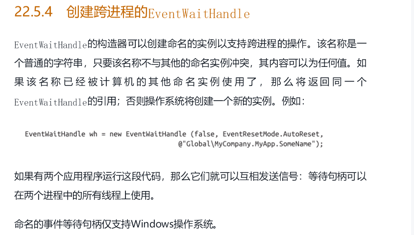
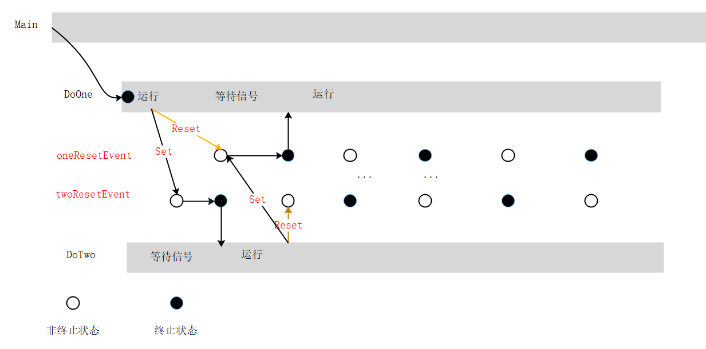
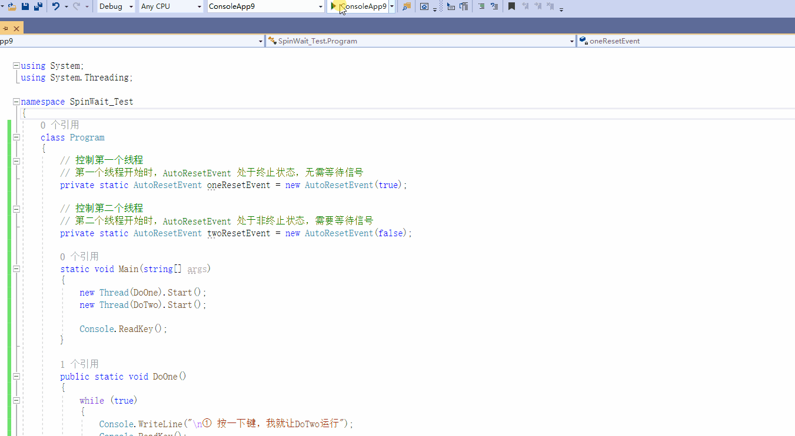

# 2.4 线程通知

### 导读

回顾一下，前面 lock、Monitor 部分我们学习了线程锁，Mutex 部分学习了进程同步，Semaphor 部分学习了资源池限制。

这一篇将学习 C# 中用于发送线程通知的 AutoRestEvent 类。



【图来自《C# 7.0 核心技术指南》】


## AutoRestEvent 类

用于从一个线程向另一个线程发送通知。

微软文档是这样介绍的：表示线程同步事件在一个等待线程释放后收到信号时自动重置。


其构造函数只有一个：

构造函数里面的参数用于设置信号状态。

| 构造函数                | 说明                                                         |
| ----------------------- | ------------------------------------------------------------ |
| AutoResetEvent(Boolean) | 用一个指示是否将初始状态设置为终止的布尔值初始化 AutoResetEvent 类的新实例。 |

> 真糟糕的机器翻译。


### 常用方法

AutoRestEvent 类是干嘛的，构造函数的参数又是干嘛的？不着急，我们来先来看看这个类常用的方法：

| 方法    | 说明                                                         |
| ------- | ------------------------------------------------------------ |
| Close() | 释放由当前 WaitHandle 占用的所有资源。                       |
| Reset() | 将事件状态设置为非终止，从而导致线程受阻。                   |
| Set()   | 将事件状态设置为有信号，从而允许一个或多个等待线程继续执行。 |
| WaitOne()                  | 阻止当前线程，直到当前 WaitHandle 收到信号。                 |
| WaitOne(Int32)             | 阻止当前线程，直到当前 WaitHandle 收到信号，同时使用 32 位带符号整数指定时间间隔（以毫秒为单位）。 |
| WaitOne(Int32, Boolean)    | 阻止当前线程，直到当前的 WaitHandle 收到信号为止，同时使用 32 位带符号整数指定时间间隔，并指定是否在等待之前退出同步域。 |
| WaitOne(TimeSpan)          | 阻止当前线程，直到当前实例收到信号，同时使用 TimeSpan 指定时间间隔。 |
| WaitOne(TimeSpan, Boolean) | 阻止当前线程，直到当前实例收到信号为止，同时使用 TimeSpan 指定时间间隔，并指定是否在等待之前退出同步域。 |


### 一个简单的示例

这里我们编写一个这样的程序：

创建一个线程，能够执行多个阶段的任务；每完成一个阶段，都需要停下来，等待子线程发生通知，才能继续下一步执行。

`.WaitOne()` 用来等待另一个线程发送通知；

 `.Set()` 用来对线程发出通知，此时 `AutoResetEvent` 变成终止状态；

`.ReSet()` 用来重置 `AutoResetEvent` 状态；


```csharp
    class Program
    {
        // 线程通知
        private static AutoResetEvent resetEvent = new AutoResetEvent(false);

        static void Main(string[] args)
        {
            // 创建线程
            new Thread(DoOne).Start();

            // 用于不断向另一个线程发送信号
            while (true)
            {
                Console.ReadKey();
                resetEvent.Set();           // 发生通知，设置终止状态
            }
        }

        public static void DoOne()
        {
            Console.WriteLine("等待中，请发出信号允许我运行");

            // 等待其它线程发送信号
            resetEvent.WaitOne();

            Console.WriteLine("\n     收到信号，继续执行");
            for (int i = 0; i < 5; i++) Thread.Sleep(TimeSpan.FromSeconds(0.5));

            resetEvent.Reset(); // 重置为非终止状态
            Console.WriteLine("\n第一阶段运行完毕，请继续给予指示");

            // 等待其它线程发送信号
            resetEvent.WaitOne();
            Console.WriteLine("\n     收到信号，继续执行");
            for (int i = 0; i < 5; i++) Thread.Sleep(TimeSpan.FromSeconds(0.5));

            Console.WriteLine("\n第二阶段运行完毕，线程结束，请手动关闭窗口");
        }
    }
```


在这个过程中，出现了主线程、子线程协调，共同完成任务。


### 解释一下

AutoResetEvent 对象有终止和非终止状态。`Set()` 设置终止状态，`Reset()` 重置非终止状态。

这个终止状态，可以理解成信号已经通知；非终止状态则是信号还没有通知。

注意，注意终止状态和非终止状态指的是 AutoResetEvent 的状态，不是指线程的状态。

<p>
<div style="color: rgb(23, 23, 23); font-family: &quot;Segoe UI&quot;, SegoeUI, &quot;Segoe WP&quot;, &quot;Helvetica Neue&quot;, Helvetica, Tahoma, Arial, sans-serif; background-color: rgb(255, 241, 204);border-radius: 10px;padding:20px;">
线程通过调用 WaitOne() 方法，等待信号；<br />
    另一个线程可以调用 Set() 通知 AutoResetEvent 释放等待线程。<br />
    然后 AutoResetEvent 变为终止状态。
</div>
</p>

需要注意的是，如果 AutoResetEvent 已经处于终止状态，那么线程调用 `WaitOne()` 不会再起作用。除非调用`Reset()` 。


构造函数中的参数，正是设置这个状态的。true 代表终止状态，false 代表非终止状态。如果使用 `new AutoResetEvent(true);` ，则线程一开始是无需等待信号的。

在使用完类型后，您应直接或间接释放类型，显式调用 `Close()/Dispose()` 或 使用 `using`。 当然，也可以直接退出程序。


需要注意的是，如果多次调用 `Set()` 的时间间隔过短，如果第一次 `Set()` 还没有结束(信号发送需要处理时间)，那么第二次 `Set()`  可能无效(不起作用)。


### 复杂一点的示例

我们设计一个程序：

* Two 线程开始处于阻塞状态；
* 线程 One 可以设置线程 Two 继续运行，然后阻塞自己；
* 线程 Two 可以设置 One 继续运行，然后阻塞自己；




程序代码如下(运行后，请将键盘设置成英文输入状态再按下按键)：


```csharrp
    class Program
    {
        // 控制第一个线程
        // 第一个线程开始时，AutoResetEvent 处于终止状态，无需等待信号
        private static AutoResetEvent oneResetEvent = new AutoResetEvent(true);

        // 控制第二个线程
        // 第二个线程开始时，AutoResetEvent 处于非终止状态，需要等待信号
        private static AutoResetEvent twoResetEvent = new AutoResetEvent(false);

        static void Main(string[] args)
        {
            new Thread(DoOne).Start();
            new Thread(DoTwo).Start();

            Console.ReadKey();
        }

        public static void DoOne()
        {
            while (true)
            {
                Console.WriteLine("\n① 按一下键，我就让DoTwo运行");
                Console.ReadKey();
                twoResetEvent.Set();
                oneResetEvent.Reset();
                // 等待 DoTwo() 给我信号
                oneResetEvent.WaitOne();

                Console.ForegroundColor = ConsoleColor.Green;
                Console.WriteLine("\n     DoOne() 执行");
                Console.ForegroundColor = ConsoleColor.White;
            }
        }

        public static void DoTwo()
        {
            while (true)
            {
                Thread.Sleep(TimeSpan.FromSeconds(1));

                // 等待 DoOne() 给我信号
                twoResetEvent.WaitOne();

                Console.ForegroundColor = ConsoleColor.Yellow;
                Console.WriteLine("\n     DoTwo() 执行");
                Console.ForegroundColor = ConsoleColor.White;

                Console.WriteLine("\n② 按一下键，我就让DoOne运行");
                Console.ReadKey();
                oneResetEvent.Set();
                twoResetEvent.Reset();
            }
        }
    }
```




### 解释

两个线程具有的功能：阻塞自己、解除另一个线程的阻塞。

用电影《最佳拍档》里面的一个画面来理解。

DoOne 、DoTwo 轮流呼吸，不能自己控制自己呼吸，但自己能够决定别人呼吸。

你搞我，我搞你，就能相互呼吸了。


当然`WaitOne()` 也可以设置等待时间，如果 光头佬(DoOne) 耍赖不让 金刚(DoTwo)呼吸，金刚等待一定时间后，**可以强行荡动天平，落地呼吸**。

<p>
<div style="color: rgb(23, 23, 23); font-family: &quot;Segoe UI&quot;, SegoeUI, &quot;Segoe WP&quot;, &quot;Helvetica Neue&quot;, Helvetica, Tahoma, Arial, sans-serif; background-color: rgb(255, 241, 204);border-radius: 10px;padding:20px;">
注意，AutoRestEvent 用得不当容易发生死锁。
<br />
另外 AutoRestEvent 使用的是内核时间模式，因此等待时间不能太长，不然比较耗费 CPU 时间。
</div>
</p>


AutoResetEvent 也适合用于线程同步。