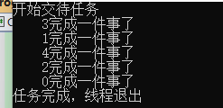

# 2.7 线程完成数

### 解决一个问题

假如，程序需要向一个 Web 发送 5 次请求，受网路波动影响，有一定几率请求失败。如果失败了，就需要重试。

示例代码如下：

```csharp
    class Program
    {
        private static int count = 0;
        static void Main(string[] args)
        {
            for (int i = 0; i < 5; i++)
                new Thread(HttpRequest).Start();            // 创建线程

            // 用于不断向另一个线程发送信号
            while (count < 5)
            {
                Thread.Sleep(100);
            }
            Console.WriteLine("任务执行完毕");
        }


        // 模拟网络请求
        public static void HttpRequest()
        {
            Console.WriteLine("开始一个任务");
            // 随机生成一个数，如果为偶数，则模拟请求失败
            bool isSuccess = (new Random().Next(0, 10)) % 2 == 0;

            // ... ...模拟请求 HTTP
            Thread.Sleep(TimeSpan.FromSeconds(2));

            // 请求失败则重试
            if (!isSuccess)
            {
                Console.WriteLine($"请求失败,count={count}");
                new Thread(() =>
                {
                    HttpRequest();
                }).Start();
                return;
            }
            // 完成一次任务，+1
            Interlocked.Add(ref count,1);
            Console.WriteLine($"完成任务，count={count}");
        }
    }
```

这个代码太糟糕了，我们可以使用 CountdownEvent 类来改造它。


## CountdownEvent 类

表示在计数变为零时处于有信号状态的同步基元。

也就是说，设定一个计数器，每个线程完成后，就会减去 1 ，当计数器为 0 时，代表所有线程都已经完成了任务。


### 构造函数和方法

CountdownEvent 类的构造函数如下：

| 构造函数              | 说明                                           |
| --------------------- | ---------------------------------------------- |
| CountdownEvent(Int32) | 使用指定计数初始化 CountdownEvent 类的新实例。 |

CountdownEvent 类的常用方法如下：

| 方法                              | 说明                                                         |
| --------------------------------- | ------------------------------------------------------------ |
| AddCount()                        | 将 CountdownEvent 的当前计数加 1。                           |
| AddCount(Int32)                   | 将 CountdownEvent 的当前计数增加指定值。                     |
| Reset()                           | 将 CurrentCount 重置为 InitialCount 的值。                   |
| Reset(Int32)                      | 将 InitialCount 属性重新设置为指定值。                       |
| Signal()                          | 向 CountdownEvent 注册信号，同时减小 CurrentCount 的值。     |
| Signal(Int32)                     | 向 CountdownEvent 注册多个信号，同时将 CurrentCount 的值减少指定数量。 |
| TryAddCount()                     | 增加一个 CurrentCount 的尝试。                               |
| TryAddCount(Int32)                | 增加指定值的 CurrentCount 的尝试。                           |
| Wait()                            | 阻止当前线程，直到设置了 CountdownEvent 为止。               |
| Wait(CancellationToken)           | 阻止当前线程，直到设置了 CountdownEvent 为止，同时观察 CancellationToken。 |
| Wait(Int32)                       | 阻止当前线程，直到设置了 CountdownEvent 为止，同时使用 32 位带符号整数测量超时。 |
| Wait(Int32, CancellationToken)    | 阻止当前线程，直到设置了 CountdownEvent 为止，并使用 32 位带符号整数测量超时，同时观察 CancellationToken。 |
| Wait(TimeSpan)                    | 阻止当前线程，直到设置了 CountdownEvent 为止，同时使用 TimeSpan 测量超时。 |
| Wait(TimeSpan, CancellationToken) | 阻止当前线程，直到设置了 CountdownEvent 为止，并使用 TimeSpan 测量超时，同时观察 CancellationToken。 |

API 比较多，没事，我们来慢慢了解它。


### 示例

我们来编写一个场景代码，一个有五件事，需要完成，分别派出 5 个人去实现。

`.Wait();` 用在一个线程中，这个线程将等待其它完成都完成任务后，才能继续往下执行。

`Signal();` 用于工作线程中，向 CountdownEvent  对象发送信号，告知线程已经完成任务，然后 `CountdownEvent.CurrentCount` 将减去 1。

当计数器为 0 时，阻塞的线程将恢复执行。

代码示例如下：

```c#
    class Program
    {
        // 手头上有 5 件事
        private static CountdownEvent countd = new CountdownEvent(5);
        static void Main(string[] args)
        {
            Console.WriteLine("开始交待任务");
            // 同时叫 5 个人，去做 5 件事
            for (int i = 0; i < 5; i++)
            {
                Thread thread = new Thread(DoOne);
                thread.Name = $"{i}";
                thread.Start();
            }


            // 等他们都完成事情
            countd.Wait();

            Thread.Sleep(500);
            Console.WriteLine("任务完成，线程退出");
            Console.ReadKey();
        }

        public static void DoOne()
        {
            int n = new Random().Next(0, 10);
            // 模拟要 n 秒才能完成
            Thread.Sleep(TimeSpan.FromSeconds(n));
            // 完成了，减去一件事
            countd.Signal();
            Console.WriteLine($"    {Thread.CurrentThread.Name}完成一件事了");
        }
    }
```



示例很简单，每个线程在完成自己的任务时，需要调用 `Signal()` 方法，使得计数器减去1。

`.Wait();` 可以等待所有的任务完成。

需要注意的是，如果不调用 `Signal()` 或者计数器一直不为0，那么 `Wait()` 将无限等待。

 当然，`Wait()` 可以设置等待时间，


另外我们也看到了常用方法中有 `AddCount()`、`Reset()`等。

这个类的等待控制方式比较宽松，`Wait()` 后，到底什么时候才能执行，全凭其它线程自觉。

如果发现线程执行任务失败，我们可以不调用 `Signal()` 或者 使用 `AddCount()` 来增加次数，进行重试