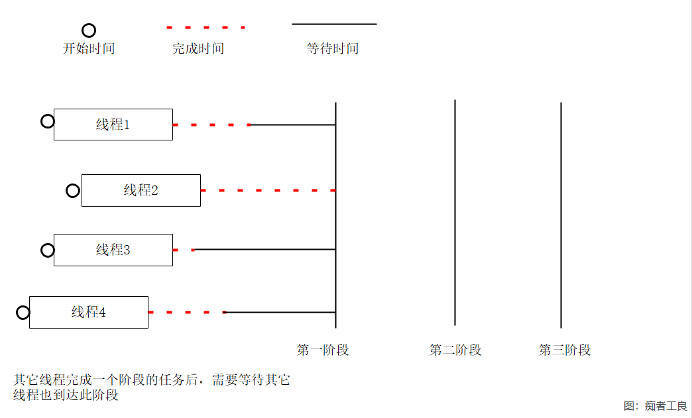

# 2.8 并行协调

### 导读

这一篇，我们将学习用于实现并行任务、使得多个线程有序同步完成多个阶段的任务。

应用场景主要是控制 N 个线程(可随时增加或减少执行的线程)，使得多线程在能够在 M 个阶段中保持同步。

线程工作情况如下：



我们接下来 将学习C# 中的 Barrier ，用于实现并行协同工作。


## Barrier 类

使多个任务能够采用并行方式依据某种算法在多个阶段中协同工作，使多个线程（称为“参与者” ）分阶段同时处理**算法**。

可以使多个线程（称为“参与者” ）分阶段同时处理**算法**。（注意算法这个词）

每个参与者完成阶段任务后后将被阻止继续执行，直至所有参与者都已达到同一阶段。 


Barrier 的构造函数如下：

| 构造函数               | 说明                        |
| ---------------------- | --------------------------- |
| Barrier(Int32)         | 初始化 Barrier 类的新实例。 |
| Barrier(Int32, Action) | 初始化 Barrier 类的新实例。 |
其中一个构造函数定义如下：
```C#
public Barrier (int participantCount, Action<Barrier> postPhaseAction);
```

participantCount ：处于的线程数量，大于0并且小于32767。

postPhaseAction ：在每个阶段后执行 Action(委托)。


### 属性和方法

在还没有清楚这个类有什么作用前，我们来看一下这个类的常用属性和方法。

大概了解 Barrier 有哪些常用属性和方法后，我们开始编写示例代码。

属性：

| 属性                  | 说明                                             |
| --------------------- | ------------------------------------------------ |
| CurrentPhaseNumber    | 获取屏障的当前阶段的编号。                       |
| ParticipantCount      | 获取屏障中参与者的总数。                         |
| ParticipantsRemaining | 获取屏障中尚未在当前阶段发出信号的参与者的数量。 |

方法：

| 方法                                       | 说明                                                         |
| ------------------------------------------ | ------------------------------------------------------------ |
| AddParticipant()                           | 通知 Barrier，告知其将会有另一个参与者。                     |
| AddParticipants(Int32)                     | 通知 Barrier，告知其将会有多个其他参与者。                   |
| RemoveParticipant()                        | 通知 Barrier，告知其将会减少一个参与者。                     |
| RemoveParticipants(Int32)                  | 通知 Barrier，告知其将会减少一些参与者。                     |
| SignalAndWait()                            | 发出参与者已达到屏障并等待所有其他参与者也达到屏障。         |
| SignalAndWait(CancellationToken)           | 发出参与者已达到屏障的信号，并等待所有其他参与者达到屏障，同时观察取消标记。 |
| SignalAndWait(Int32)                       | 发出参与者已达到屏障的信号，并等待所有其他参与者也达到屏障，同时使用 32 位带符号整数测量超时。 |
| SignalAndWait(Int32, CancellationToken)    | 发出参与者已达到屏障的信号，并等待所有其他参与者也达到屏障，使用 32 位带符号整数测量超时，同时观察取消标记。 |
| SignalAndWait(TimeSpan)                    | 发出参与者已达到屏障的信号，并等待所有其他参与者也达到屏障，同时使用 TimeSpan 对象测量时间间隔。 |
| SignalAndWait(TimeSpan, CancellationToken) | 发出参与者已达到屏障的信号，并等待所有其他参与者也达到屏障，使用 TimeSpan 对象测量时间间隔，同时观察取消标记。 |

Barrier 翻译屏障，前面所说的 “阶段”，在文档中称为屏障，官方有一些例子和实践场景：

**https://docs.microsoft.com/zh-cn/dotnet/standard/threading/barrier?view=netcore-3.1**

https://docs.microsoft.com/zh-cn/dotnet/standard/threading/how-to-synchronize-concurrent-operations-with-a-barrier?view=netcore-3.1

本文的教程比较简单，你可以先看本教程，再去看看官方示例。


### 示例

假设有个比赛，一个有三个环节，有三个小组参加比赛。

比赛有三个环节，小组完成一个环节后，可以去等待区休息，等待其他小组也完成比赛后，开始进行下一个环节的比赛。

示例如下：

`new Barrier(int,Action)` 设置有多少线程参与，Action 委托设置每个阶段完成后执行哪些动作。

`.SignalAndWait()` 阻止当前线程继续往下执行；直到其他完成也执行到此为止。

```csharp
    class Program
    {
        // Barrier(Int32, Action)
        private static Barrier barrier = new Barrier(3, b =>
                            Console.WriteLine($"\n第 {b.CurrentPhaseNumber + 1} 环节的比赛结束，请评分！"));

        static void Main(string[] args)
        {
            // Random 模拟每个小组完成一个环节比赛需要的时间
            Thread thread1 = new Thread(() => DoWork("第一小组", new Random().Next(2, 10)));
            Thread thread2 = new Thread(() => DoWork("第二小组", new Random().Next(2, 10)));
            Thread thread3 = new Thread(() => DoWork("第三小组", new Random().Next(2, 10)));

            // 三个小组开始比赛
            thread1.Start();
            thread2.Start();
            thread3.Start();


            Console.ReadKey();
        }
        static void DoWork(string name, int seconds)
        {
            // 第一环节
            Console.WriteLine($"\n{name}：开始进入第一环节比赛");
            Thread.Sleep(TimeSpan.FromSeconds(seconds));    // 模拟小组完成环节比赛需要的时间
            Console.WriteLine($"\n    {name}：完成第一环节比赛，等待其它小组");
            // 小组完成阶段任务，去休息等待其它小组也完成比赛
            barrier.SignalAndWait();

            // 第二环节
            Console.WriteLine($"\n        {name}：开始进入第二环节比赛");
            Thread.Sleep(TimeSpan.FromSeconds(seconds));
            Console.WriteLine($"\n        {name}：完成第二环节比赛，等待其它小组\n");
            barrier.SignalAndWait();


            // 第三环节
            Console.WriteLine($"\n        {name}：开始进入第三环节比赛");
            Thread.Sleep(TimeSpan.FromSeconds(seconds));
            Console.WriteLine($"\n        {name}：完成第三环节比赛，等待其它小组\n");
            barrier.SignalAndWait();
        }
    }
```


上面的示例中，每个线程都使用了 `DoWork()` 这个方法去中相同的事情，当然也可以设置多个线程执行不同的任务，但是必须保证每个线程都具有相同数量的 `.SignalAndWait();` 方法。

当然 `SignalAndWait()` 可以设置等待时间，如果其他线程迟迟没有到这一步，那就继续运行。可以避免死锁等问题。

到目前，只使用了 `SignalAndWait()` ，我们继续学习一下 Barrier 类的其他方法。


### 线程淘汰

`Barrier.AddParticipant()`：添加参与者；

`Barrier.RemoveParticipant()`：移除参与者；


因为这是比赛，老是等待其他小组，会使得比赛进行比较慢。这里继续使用第二节的示例，当发现有些线程执行中出现特殊情况时，可以移除这些线程，让正常的线程继续执行下去。

新的规则：不必等待最后一名，当环节只剩下最后一名时为完成时，其它小组可以立即进行下一个环节的比赛。

​					当然，最后一名小组，有权利继续完成比赛。

修改第二小节的代码，在 Main 内第一行加上 `barrier.RemoveParticipant();`。

```csharp
        static void Main(string[] args)
        {
            barrier.RemoveParticipant();
            ... ...
```

试着再运行一下。


### 说明

`SignalAndWait()` 的 重载比较多，例如 `SignalAndWait(CancellationToken)`，这里笔者先不讲解此方法如何使用。等到写到后面的异步(`Task`)，读者学到相关的知识点，我们再过一次复习，这样由易到难，自然水到渠成。

Barrier 适合用于同时执行相同流程的工作，因为工作内容是相同的，便于协同。工作流有可能用得上吧。

但是 Barrier 更加适合用于算法领域，可以参考：https://devblogs.microsoft.com/pfxteam/parallel-merge-sort-using-barrier/

当然，后面学习异步和并行编程后，也会编写相应的算法示例。