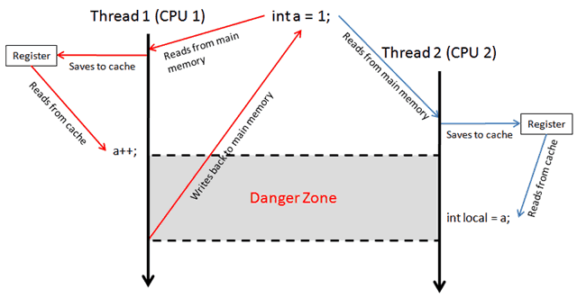

# 2.9 自旋

自旋和阻塞的区别自旋与阻塞有一些细微的差别。首先，非常短暂的自旋在条件可以很快得到满足的场景（例如几微秒）下是非常高效的，因为它避免了上下文切换带来的延迟和开销。.NET Core提供了一些特殊的辅助方法和类来进行这一操作，请参见http://albahari.com/threading/的SpinLock and SpinWait。其次，阻塞并非零开销。这是因为每一个线程在存活时会占用1 MB左右的内存，并对CLR和操作系统带来持续性的管理开销。因此，阻塞可能会给繁重的I/O密集型程序（例如要处理成百上千的并发操作）带来麻烦。这些程序更适于使用回调的方式，在等待时完全解除这些线程。我们将在后面讨论异步模式的时候介绍这种方法。

前面我们学习了很多用于线程管理的 类型，也学习了多种线程同步的使用方法，这一篇主要讲述线程等待相关的内容。

在笔者认真探究多线程前，只会`new Thread`；锁？`Lock`；线程等待？`Thread.Sleep()`。

前面已经探究了创建线程的创建姿势和各种锁的使用，也学习了很多类型，也使用到了很多种等待方法，例如 `Thread.Sleep()`、`Thread.SpinWait();`、`{某种锁}.WaitOne()` 等。

这些等待会影响代码的算法逻辑和程序的性能，也有可能会造成死锁，在本篇我们将会慢慢探究线程中等待。


### volatile 关键字


System.Threading.Volatile 、int 可以，long 不可用

`volatile` 关键字指示一个字段可以由多个同时执行的线程修改。

我们继续使用[《C#多线程(3)：原子操作》](https://www.cnblogs.com/whuanle/p/12724371.html)中的示例：

```csharp
        static void Main(string[] args)
        {
            for (int i = 0; i < 5; i++)
            {
                new Thread(AddOne).Start();
            }
            Thread.Sleep(TimeSpan.FromSeconds(5));
            Console.WriteLine("sum = " + sum);
            Console.ReadKey();
        }
        private static int sum = 0;
        public static void AddOne()
        {
            for (int i = 0; i < 100_0000; i++)
            {
                sum += 1;
            }
        }
```

运行后你会发现，结果不为 500_0000，而使用 `Interlocked.Increment(ref sum);`后，可以获得准确可靠的结果。

你试试再运行下面的示例：

```csharp
        static void Main(string[] args)
        {
            for (int i = 0; i < 5; i++)
            {
                new Thread(AddOne).Start();
            }
            Thread.Sleep(TimeSpan.FromSeconds(5));
            Console.WriteLine("sum = " + sum);
            Console.ReadKey();
        }
        private static volatile int sum = 0;
        public static void AddOne()
        {
            for (int i = 0; i < 100_0000; i++)
            {
                sum += 1;
            }
        }
```

你以为正常了？哈哈哈，并没有。

volatile 的作用在于读，保证了观察的顺序和写入的顺序一致，每次读取的都是最新的一个值；不会干扰写操作。

详情请点击：[https://docs.microsoft.com/zh-cn/dotnet/csharp/language-reference/keywords/volatile](https://docs.microsoft.com/zh-cn/dotnet/csharp/language-reference/keywords/volatile)

其原理解释：[https://theburningmonk.com/2010/03/threading-understanding-the-volatile-modifier-in-csharp/](https://theburningmonk.com/2010/03/threading-understanding-the-volatile-modifier-in-csharp/)



### 三种常用等待

这三种等待分别是：

```csharp
Thread.Sleep();
```

```csharp
Thread.SpinWait();
```

```csharp
Task.Delay();
```

`Thread.Sleep();` 会阻塞线程，使得线程交出时间片，然后处于休眠状态，直至被重新唤醒；适合用于长时间的等待；

<br />

`Thread.SpinWait();` 使用了自旋等待，等待过程中会进行一些的运算，线程不会休眠，用于微小的时间等待；长时间等待会影响性能；

<br />

`Task.Delay();` 用于异步中的等待，异步的文章后面才写，这里先不理会；

<br />

这里我们还需要继续 SpinWait 和 SpinLock 这两个类型，最后再进行总结对照。


### 再说自旋和阻塞

前面我们学习过自旋和阻塞的区别，这里再来撸清楚一下。

线程等待有内核模式(Kernel Mode)和用户模式(User Model)。

因为只有操作系统才能控制线程的生命周期，因此使用 `Thread.Sleep()` 等方式阻塞线程，发生上下文切换，此种等待称为内核模式。

用户模式使线程等待，并不需要线程切换上下文，而是让线程通过执行一些无意义的运算，实现等待。也称为自旋。


## SpinWait 结构

微软文档定义：为基于自旋的等待提供支持。

<p>
    <div style="color: rgb(23, 23, 23); font-family: &quot;Segoe UI&quot;, SegoeUI, &quot;Segoe WP&quot;, &quot;Helvetica Neue&quot;, Helvetica, Tahoma, Arial, sans-serif; background-color: rgb(255, 241, 204);border-radius: 10px;padding:20px;">
SpinWait 是结构体；Thread.SpinWait() 的原理就是 SpinWait 。<br />如果你想了解 Thread.SpinWait() 是怎么实现的，可以参考 <a href="https://www.tabsoverspaces.com/233735-how-is-thread-spinwait-actually-implemented">https://www.tabsoverspaces.com/233735-how-is-thread-spinwait-actually-implemented</a>
</div>
</p>

线程阻塞是会耗费上下文切换的，对于过短的线程等待，这种切换的代价会比较昂贵的。在我们前面的示例中，大量使用了 `Thread.Sleep()` 和各种类型的等待方法，这其实是不合理的。

SpinWait 则提供了更好的选择。


### 属性和方法

老规矩，先来看一下 SpinWait 常用的属性和方法。

属性：

| 属性              | 说明                                                         |
| ----------------- | ------------------------------------------------------------ |
| Count             | 获取已对此实例调用 SpinOnce() 的次数。                       |
| NextSpinWillYield | 获取对 SpinOnce() 的下一次调用是否将产生处理器，同时触发强制上下文切换。 |

方法：

| 方法                      | 说明                                                     |
| ------------------------- | -------------------------------------------------------- |
| Reset()                   | 重置自旋计数器。                                         |
| SpinOnce()                | 执行单一自旋。                                           |
| SpinOnce(Int32)           | 执行单一自旋，并在达到最小旋转计数后调用 Sleep(Int32) 。 |
| SpinUntil(Func)           | 在指定条件得到满足之前自旋。                             |
| SpinUntil(Func, Int32)    | 在指定条件得到满足或指定超时过期之前自旋。               |
| SpinUntil(Func, TimeSpan) | 在指定条件得到满足或指定超时过期之前自旋。               |


### 自旋示例

下面来实现一个让当前线程等待其它线程完成任务的功能。

其功能是开辟一个线程对 sum 进行 `+1`，当新的线程完成运算后，主线程才能继续运行。

```csharp
    class Program
    {
        static void Main(string[] args)
        {
            new Thread(DoWork).Start();

            // 等待上面的线程完成工作
            MySleep();

            Console.WriteLine("sum = " + sum);
            Console.ReadKey();
        }

        private static int sum = 0;
        private static void DoWork()
        {
            for (int i = 0; i < 1000_0000; i++)
            {
                sum++;
            }
            isCompleted = true;
        }

        // 自定义等待等待
        private static bool isCompleted = false;
        private static void MySleep()
        {
            int i = 0;
            while (!isCompleted)
            {
                i++;
            }
        }
    }
```


### 新的实现

我们改进上面的示例，修改 MySleep 方法，改成：

```csharp
        private static bool isCompleted = false;        
        private static void MySleep()
        {
            SpinWait wait = new SpinWait();
            while (!isCompleted)
            {
                wait.SpinOnce();
            }
        }
```

或者改成

```csharp
        private static bool isCompleted = false;        
        private static void MySleep()
        {
            SpinWait.SpinUntil(() => isCompleted);
        }
```


## SpinLock 结构

微软文档：提供一个相互排斥锁基元，在该基元中，尝试获取锁的线程将在重复检查的循环中等待，直至该锁变为可用为止。

SpinLock 称为自旋锁，适合用在频繁争用而且等待时间较短的场景。主要特征是避免了阻塞，不出现昂贵的上下文切换。

笔者水平有限，关于 SpinLock ，可以参考 [https://www.c-sharpcorner.com/UploadFile/1d42da/spinlock-class-in-threading-C-Sharp/](https://www.c-sharpcorner.com/UploadFile/1d42da/spinlock-class-in-threading-C-Sharp/)

另外，还记得 Monitor 嘛？SpinLock 跟 Monitor 比较像噢~[https://www.cnblogs.com/whuanle/p/12722853.html#2monitor](https://www.cnblogs.com/whuanle/p/12722853.html#2monitor)

在《C#多线程(10：读写锁)》中，我们介绍了 ReaderWriterLock 和 ReaderWriterLockSlim ，而 ReaderWriterLockSlim 内部依赖于 SpinLock，并且比 ReaderWriterLock 快了三倍。


### 属性和方法

SpinLock  常用属性和方法如下：

属性：

| 属性                         | 说明                                     |
| ---------------------------- | ---------------------------------------- |
| IsHeld                       | 获取锁当前是否已由任何线程占用。         |
| IsHeldByCurrentThread        | 获取锁是否已由当前线程占用。             |
| IsThreadOwnerTrackingEnabled | 获取是否已为此实例启用了线程所有权跟踪。 |

方法：

| 方法                        | 说明                                                         |
| --------------------------- | ------------------------------------------------------------ |
| Enter(Boolean)              | 采用可靠的方式获取锁，这样，即使在方法调用中发生异常的情况下，都能采用可靠的方式检查 `lockTaken` 以确定是否已获取锁。 |
| Exit()                      | 释放锁。                                                     |
| Exit(Boolean)               | 释放锁。                                                     |
| TryEnter(Boolean)           | 尝试采用可靠的方式获取锁，这样，即使在方法调用中发生异常的情况下，都能采用可靠的方式检查 `lockTaken` 以确定是否已获取锁。 |
| TryEnter(Int32, Boolean)    | 尝试采用可靠的方式获取锁，这样，即使在方法调用中发生异常的情况下，都能采用可靠的方式检查 `lockTaken` 以确定是否已获取锁。 |
| TryEnter(TimeSpan, Boolean) | 尝试采用可靠的方式获取锁，这样，即使在方法调用中发生异常的情况下，都能采用可靠的方式检查 `lockTaken` 以确定是否已获取锁。 |


### 示例

SpinLock 的模板如下：

```csharp
        private static void DoWork()
        {
            SpinLock spinLock = new SpinLock();
            bool isGetLock = false;     // 是否已获得了锁
            try
            {
                spinLock.Enter(ref isGetLock);
                // 运算
            }
            finally
            {
                if (isGetLock)
                    spinLock.Exit();
            }
        }
```

这里就不写场景示例了。

需要注意的是， SpinLock 实例不能共享，也不能重复使用。


### 等待性能对比

大佬的文章，.NET 中的多种锁性能测试数据：[http://kejser.org/synchronisation-in-net-part-3-spinlocks-and-interlocks/](http://kejser.org/synchronisation-in-net-part-3-spinlocks-and-interlocks/)

这里我们简单测试一下阻塞和自旋的性能测试对比。

我们经常说，`Thread.Sleep()` 会发生上下文切换，出现比较大的性能损失。具体有多大呢？我们来测试一下。（以下运算都是在 Debug 下测试）

测试 `Thread.Sleep(1)`：

```csharp
        private static void DoWork()
        {
            Stopwatch watch = new Stopwatch();
            watch.Start();
            for (int i = 0; i < 1_0000; i++)
            {
                Thread.Sleep(1);
            }
            watch.Stop();
            Console.WriteLine(watch.ElapsedMilliseconds);
        }
```

笔者机器测试，结果大约 20018。`Thread.Sleep(1)` 减去等待的时间 10000 毫秒，那么进行 10000 次上下文切换需要花费 10000 毫秒，约每次 1 毫秒。

上面示例改成：

```csharp
            for (int i = 0; i < 1_0000; i++)
            {
                Thread.Sleep(2);
            }
```

运算，发现结果为 30013，也说明了上下文切换，大约需要一毫秒。


改成 `Thread.SpinWait(1000)`：

```csharp
            for (int i = 0; i < 100_0000; i++)
            {
                Thread.SpinWait(1000);
            }
```

结果为 28876，说明自旋 1000 次，大约需要 0.03 毫秒。

### 【2.7】自旋和休眠

当线程处于进入休眠状态或解除休眠状态时，会发生上下文切换，这就带来了昂贵的消耗。

而线程不断运行，就会消耗 CPU 时间，占用 CPU 资源。


对于过短的等待，应该使用自旋(spin)方法，避免发生上下文切换；过长的等待应该使线程休眠，避免占用大量 CPU 时间。

我们可以使用最为熟知的 `Sleep()` 方法休眠线程。有很多同步线程的类型，也使用了休眠手段等待线程（已经写好草稿啦）。


自旋的意思是，没事找事做。

例如：

```csharp
        public static void Test(int n)
        {
            int num = 0;
            for (int i=0;i<n;i++)
            {
                num += 1;
            }
        }
```

通过做一些简单的运算，来消耗时间，从而达到等待的目的。

C# 中有关于自旋的自旋锁和 `Thread.SpinWait();` 方法，在后面的线程同步分类中会说到自旋锁。

`Thread.SpinWait()` 在极少数情况下，避免线程使用上下文切换很有用。其定义如下

```csharp
public static void SpinWait(int iterations);
```

SpinWait 实质上是（处理器）使用了非常紧密的循环，并使用 `iterations` 参数指定的循环计数。 SpinWait 等待时间取决于处理器的速度。

<p>
    <div style="color: rgb(23, 23, 23); font-family: &quot;Segoe UI&quot;, SegoeUI, &quot;Segoe WP&quot;, &quot;Helvetica Neue&quot;, Helvetica, Tahoma, Arial, sans-serif; background-color: rgb(255, 241, 204);border-radius: 10px;padding:20px;">
	SpinWait 无法使你准确控制等待时间，主要是使用一些锁时用到，例如 Monitor.Enter。 
</div>
</p>
