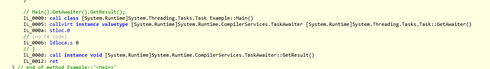

# 3.6 async 和 await


### 导读

扯淡了 这么多 篇，这篇终于开始学习 async 和 await 了，有了前面的基础，来理解 async 和 await 就容易理解多了。

这一篇一定要按照每一个示例，去写代码、执行、输出结果，自己尝试分析思路。


使用 `async/await` 的时候，初学者常常会出现很多使用误区。这里，你会跟笔者从以往文章中学习到的知识，去推导，去理解 async 和 await 这两个关键字是如何使用的，又应该怎么合理使用。

这里我们不参考文档和书籍的资料，不要看文档和书籍中的示例，我们要一步步来从任务(Task)中的同步异步开始，慢慢摸索。去分析 async 和 await 两个关键字给我们的异步编程带来了什么样的便利。


### async

微软文档：使用 `async` 修饰符可将方法、lambda 表达式或匿名方法指定为异步。

使用 async 修饰的方法，称为异步方法。

例如：

为了命名规范，使用 async 修饰的方法，需要在方法名称后面加上 `Async` 。

```csharp
public async Task<int> TestAsync()  
{  
    // . . . .  
}  
```

Lambda ：

```csharp

        static void Main()
        {
            Thread thread = new Thread(async () =>
            {
                await Task.Delay(0);
            });
        }
        public static async Task<int> TestAsync() => 666;
```

### await

微软文档：`await` 运算符暂停对其所属的 `async` 方法的求值，直到其操作数表示的异步操作完成。 

异步操作完成后，`await` 运算符将返回操作的结果（如果有），如果你使用了 await ，那么**这段代码相当于变成同步了**。

呀，这。 `async` + `await`，不是异步么？？？
> 使用 async 修饰的方法是异步方法没错，加上 await 后，这段代码在逻辑上是同步的。
> 至于底层，是同步还是异步，还需要看情况。在本章以及后面的自己写一个异步状态机，可以深入讨论这个问题。
用了 `async` + `await` 就可以提高性能对吧？
> 要看是否属于异步 IO，否则并不会提高性能。


好的，到此为止，async 和 await ，就先说这么多。


### 异步 IO

前面提到了 Task、async、await 这些东西，完全没有提到性能相关的说法，因为就算用上了这些东西，也不会提高什么性能。

首先我们区分任务是计算密集型还是 IO 密集型，当涉及到网络、文件这些 IO 操作时，使用系统的异步 API ，可以提高性能。


这里涉及到计算机组成原理。CPU 很快，而 CPU 跟内存的速度差了几个数量级，因此 CPU 每次执行指令都要从内存中取数据的话，会严重拖慢 CPU，因此出现了多级 CPU 缓存。

计算机中存在着 DMA 芯片，称为协处理器，它可以让内存与设备之间完成 IO 传输，而不需要 CPU 一直参与。

例如， CPU 执行指令从磁盘文件中加载文件到内存中，CPU 可以下方指令，然后 DMA 芯片控制内存跟 IO 设备传输数据，CPU 可以去执行其它任务，等 IO 操作完成，CPU 再回来执行接下来的指令。这一过程即 IO 异步。 


如果你的代码不会使用到 IO 操作，那么你写的 `async/awaiit`，也只是实现 “异步代码”，不会带来性能上的提升。          


在 C#  中，执行一个异步 IO 代码的示例如下：

```csharp
    static async Task Main()
    {
        var stream = File.OpenRead("D:/a.txt");
        string content = await new StreamReader(stream).ReadToEndAsync();
    }
```

这个代码表示打开一个文件并读取文件内容到程序内存中。我们知道，CPU 速度比内存高了几个数量级，而内存又比磁盘搞了 N 个数量级。在内存读取磁盘文件字节到内存中时，需要等待较长时间，如果让 CPU 一直在等，那么会很浪费 CPU 。

而异步 IO 可以让内存跟跟磁盘独立工作，当执行到异步 IO 的代码时，CPU 将当前代码挂起，等内存和磁盘传输完毕， CPU 再回到代码继续执行下去。

> 推荐阅读：零拷贝机制：https://www.whuanle.cn/archives/21051


### 线程同步
在前面的第二大部分中，笔者花了大量的章节解决线程同步，本小节演示如何通过 async、await 实现线程同步。

场景：下单点外卖，在等外卖的时候玩一把王者（只打一把）。如果打完一把游戏，外卖还没有到，就一直等。如果外卖到了，就直接下楼拿外卖。

我们可以编写一个示例如下：

```csharp
    static void Main()
    {
        Console.WriteLine("点击下单外卖");

        // 洗衣机在后台工作
        Task<int> task = new Task<int>(() =>
        {
            // 模拟外卖员送快递的时间
            int time = new Random().Next(2, 6);
            Thread.Sleep(TimeSpan.FromSeconds(time));
            return time;
        });

        Console.WriteLine("快递员开始配送");
        task.Start();

        Console.WriteLine("无聊中，开始打王者");

        // 打王者
        Thread.Sleep(TimeSpan.FromSeconds(4));

        Console.WriteLine("打完王者了，看看外卖到了没有？");

        
        while (task.IsCompleted == true)
        {
            Console.WriteLine("外卖到了");
        }
    }
```

在这个例子中，我们使用 Task 模拟配送员的线程，当前主线程完成自己的工作后，就会检查配送员线程是否已经完成。 

`while (task.IsCompleted == true)` 这里的代码是为了进行线程同步，对齐多个线程之间的工作。

如果我们不想自己写一个轮询，我们可以使用官方的 `Wait()`。

```csharp
        task.Wait();
         Console.WriteLine("外卖到了");
        //while (task.IsCompleted == true)
        //{
        //    Console.WriteLine("外卖到了");
        //}
```

接下来是第三个优化版本，使用 async、await。

```csharp
    static async Task Main()
    {
        Console.WriteLine("点击下单外卖");

        // 洗衣机在后台工作
        Task<int> task = new Task<int>(() =>
        {
            // 模拟外卖员送快递的时间
            int time = new Random().Next(2, 6);
            Thread.Sleep(TimeSpan.FromSeconds(time));
            return time;
        });

        Console.WriteLine("快递员开始配送");
        task.Start();

        Console.WriteLine("无聊中，开始打王者");

        // 打王者
        Thread.Sleep(TimeSpan.FromSeconds(4));

        Console.WriteLine("打完王者了，看看外卖到了没有？");

        await task;
    }
```

`await task` 只是语法糖，最后会被编译成 `.GetAwaiter().GetResult();`。



### 如果不需要线程同步
如果你不需要线程同步，那你完全可以丢弃 Task。

对 google 发起一个请求，不管成功还是失败。
```csharp
        _ = new HttpClient().GetAsync("https://www.google.com");
```

或者对异步方法使用 `async void` 而不是 `async Task`，这样调用者完全无法等待此方法。

```csharp
    static async Task Main()
    {
        TestAsync();
    }

    public static async void TestAsync()
    {
        await new HttpClient().GetAsync("https://www.google.com");
    }
```

但是不推荐使用 `async void`。
封装异步方法的规范做法是，返回 `Task`，调用者丢弃 `Task` 即可，不使用 `await` 关键字等待就行。


### 封装后台任务

前面，我们都是使用了 `new Task()` 来创建任务，而且微软官网大多使用 `Task.Run()` 来编写 async 和 await 的示例。

因此，我们可以修改前面的异步任务，改成：

```csharp
        /// <summary>
        /// 可异步可同步
        /// </summary>
        /// <returns></returns>
        public static async Task<int> TestAsync()
        {
            return await Task.Run<int>(() =>
            {
                return 666;
            });
        }
```


### 封装 IO 异步


### `async Task` 污染

在百度学习异步的时候，往往会有作者说，进入异步方法后，同步执行代码，碰到 await 后就是异步执行。

当然还有多种说法。


我们已经学习了这么多的任务(Task)知识，这一点十分容易解释。

因为使用了 async 和 await 关键字，代码最深处，必定会出现 Task 这个东西，Task 这个东西本来就是异步。碰到 await 出现异步，不是因为 await 的作用，而是因为最底层有个 Task。


如果你的一个方法使用了 `async Task`，那么调用了这个方法的其它方法，可能都需要使用 `async Task`，一定程度上会导致 ”代码污染“。