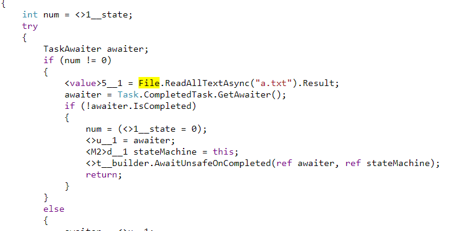
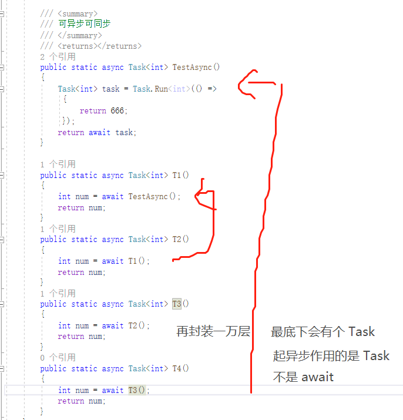
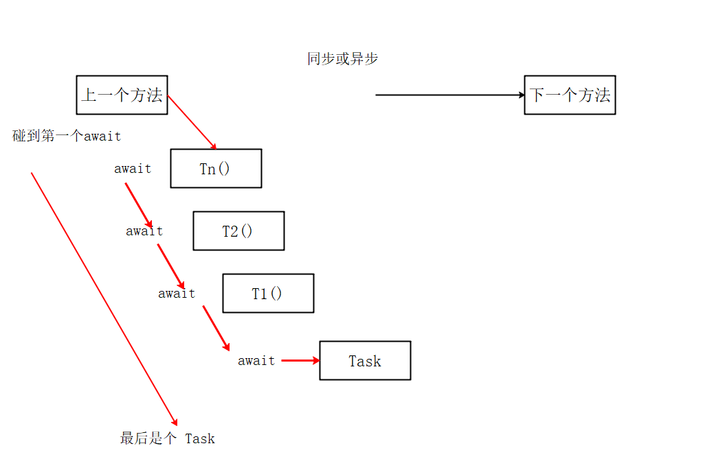
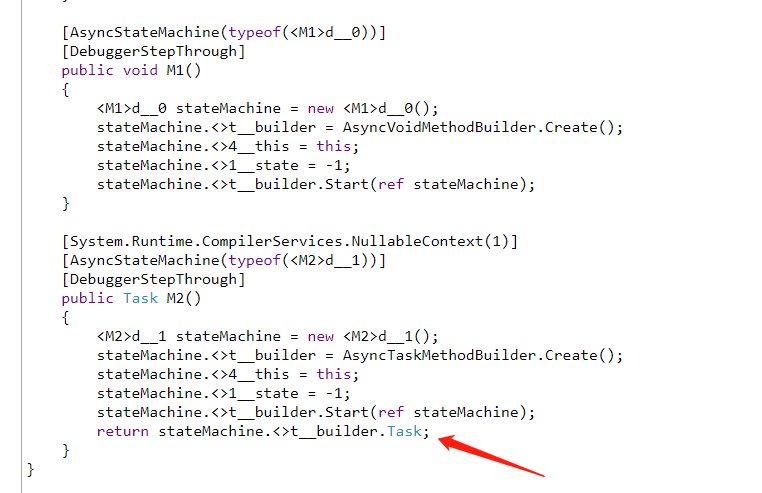
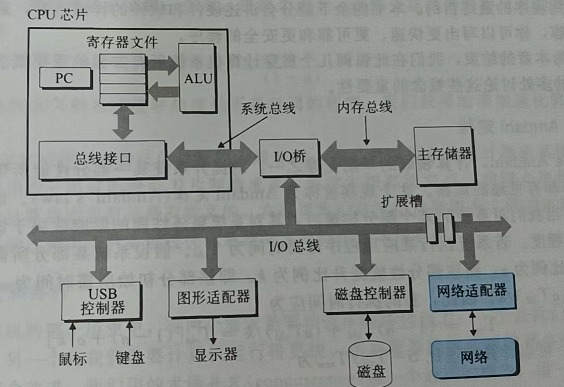

# 3.5 async 和 await


### 导读

扯淡了 这么多 篇，这篇终于开始学习 async 和 await 了。在前面我们已经学会了 Task 的各种 API，有了前面的基础，来理解 async 和 await 就容易理解多了。


本篇讲解 async、await 的简单使用。这一篇一定要按照每一个示例，去写代码、执行、输出结果，自己尝试分析思路。


使用 `async/await` 的时候，初学者常常会出现很多使用误区。这里，你会跟笔者从以往文章中学习到的知识，去推导，去理解 async 和 await 这两个关键字是如何使用的，又应该怎么合理使用。，我们要一步步来从 Task 中的同步异步开始，慢慢摸索，去分析 async 和 await 两个关键字给我们的异步编程带来了什么样的便利。


### async

微软文档：使用 `async` 修饰符可将方法、lambda 表达式或匿名方法指定为异步。

使用 async 修饰的方法，称为异步方法。

例如：

为了命名规范，使用 async 修饰的方法，需要在方法名称后面加上 `Async` 。

```csharp
public async Task<int> TestAsync()  
{  
    // . . . .  
}  
```


平时编写和使用一个方法时，我们只需要直接使用方法名称就行了。但是如果我们要在一个委托或 Lambda 中使用异步方法，可以在参数之前加上 async 关键字：

```csharp
	static void Main()
	{
		// 示例 1，
		Thread thread = new Thread(async () =>
		{
			await Task.Delay(0);
		});
	}

    // 示例 2
	public static async Task<int> TestAsync() => 666;

	public async Task M2()
	{
        // 示例 3
		test = async (a, b) =>
		{
			Console.WriteLine(a + b);
		};
	}

	Action<int, int> test;
```


在上面三个示例中，无论是哪种方式，它们的本质都是定义一个函数，只是编写形式有点不同，所以在定义函数时，我们加上 async 关键字，表示这个方法是异步函数或异步匿名函数。


一个在类里面的正经的异步函数：

```csharp
	public static async Task<int> TestAsync()
	{
		return 666;
	}
```

定义一个委托为异步委托：

```csharp
	Action<int, int> test = async (a, b) =>
		{
			Console.WriteLine(a + b);
		};
```

定义匿名函数是异步函数：

```csharp
		Thread thread = new Thread(async () =>
		{
			await Task.Delay(0);
		});
```


### await

微软文档：`await` 运算符暂停对其所属的 `async` 方法的求值，直到其操作数表示的异步操作完成。 


下面是一个示例：

```csharp
	public async Task M2()
	{
		var value = await File.ReadAllTextAsync("a.txt");
        Console.WriteLine(value);
	}
```


首先前提是，await 是语法糖，我们编写代码后，编译器首先会将 await 关键字转换为对应的 C# 语法代码，然后编译器在将去掉语法糖之后的代码编译。所以当我们使用 await 时，**要从去掉语法糖之后的代码上理解**，而替换 await 语法糖之后的代码实现，叫**状态机**。在后面的章节中，我们会上手写一个状态机去替代 await 语法糖，以便加深我们的理解，但是在本章中，我们大概了解即可。

图：状态机部分代码。




如果用伪代码表示的话，这个代码分为两步。

1，调用读取文件的接口，并设置回调函数。

2，等待回调函数完成后，继续执行代码。

```csharp
	public async Task M2()
	{
		ReadFileEx("D:/a.txt", M_2);  // M_2 代码会被系统执行
        等待回调事件完成();
        // 继续执行其它代码
	}
	public void M_2(string value)
	{
        Console.WriteLine(value);
	}
```


如果我们不使用 await 去写异步代码，我们会面临一个很重要的问题，我们如果知道回调事件已经完成，然后继续执行下面的代码？

难道手写循环？如下：

```csharp

    bool ok = false;
    public async Task M2()
	{
		ReadFileEx("D:/a.txt", M_2);  // M_2 代码会被系统执行

        while(!ok){}
        // 继续执行其它代码
	}
	public void M_2(string value)
	{
        Console.WriteLine(value);
        ok = true;
	}
```

但是 M_2 是在后台执行的，如果出现了异常，那么 ok 这个变量永远不可能是 true，M2 就会陷入无限等待。


所以，async 、await 可以大大简化我们的代码，我们根本不需要写那么多代码，语法糖帮我们完成回调封装、等待。


好的，到此为止，async 和 await ，就先说这么多。


### 线程同步

在前面的第二大部分中，笔者花了大量的章节解决线程同步问题。

到了第三部分，我们开始讲 async、await 两个关键字，依然包括线程同步。

编写 async、await 代码时，我们有两大事项要去完成：

1，异步，即在 IO 完成后，自动执行代码。实际上就是回调。

2，等待回调完成，涉及多个线程的协调，这里就是线程同步。


本小节演示如何通过 async、await 实现线程同步。


首先，如果使用 async、await，而是使用 Task 的一些函数，我们来看看如果完成实现下面的场景。


场景：下单点外卖，在等外卖的时候玩一把王者（只打一把）。如果打完一把游戏，外卖还没有到，就一直等。如果外卖到了，就直接下楼拿外卖。

我们可以编写一个示例如下：

```csharp
    static void Main()
    {
        Console.WriteLine("点击下单外卖");

        // 洗衣机在后台工作
        Task<int> task = new Task<int>(() =>
        {
            // 模拟外卖员送快递的时间
            int time = new Random().Next(2, 6);
            Thread.Sleep(TimeSpan.FromSeconds(time));
            return time;
        });

        Console.WriteLine("快递员开始配送");
        task.Start();

        Console.WriteLine("无聊中，开始打王者");

        // 打王者
        Thread.Sleep(TimeSpan.FromSeconds(4));

        Console.WriteLine("打完王者了，看看外卖到了没有？");

        
        while (task.IsCompleted == true)
        {
            Console.WriteLine("外卖到了");
        }
    }
```


在这个例子中，我们使用 Task 模拟配送员的线程，当前主线程完成自己的工作后，就会检查配送员线程是否已经完成。 

`while (task.IsCompleted == true)` 这里的代码是为了进行线程同步，对齐多个线程之间的工作。


如果我们不想自己写一个轮询，我们可以使用官方的 `Wait()`。这是第二个版本。

```csharp
        task.Wait();
         Console.WriteLine("外卖到了");
        //while (task.IsCompleted == true)
        //{
        //    Console.WriteLine("外卖到了");
        //}
```


接下来是第三个优化版本，使用 async、await。

```csharp
    static async Task Main()
    {
        Console.WriteLine("点击下单外卖");

        // 洗衣机在后台工作
        Task<int> task = new Task<int>(() =>
        {
            // 模拟外卖员送快递的时间
            int time = new Random().Next(2, 6);
            Thread.Sleep(TimeSpan.FromSeconds(time));
            return time;
        });

        Console.WriteLine("快递员开始配送");
        task.Start();

        Console.WriteLine("无聊中，开始打王者");

        // 打王者
        Thread.Sleep(TimeSpan.FromSeconds(4));

        Console.WriteLine("打完王者了，看看外卖到了没有？");

        await task;
    }
```


你看，这样是不是简单多了。


### 如果不需要线程同步

如果你不需要线程同步，那你完全可以丢弃 Task。

比如编写一个 http 客户端，对 google 发起一个请求，不管请求成功还是失败。

```csharp
        _ = new HttpClient().GetAsync("https://www.google.com");
```


或者对异步方法使用 `async void` 而不是 `async Task`，这样调用者完全无法等待此方法。

```csharp
    static async Task Main()
    {
        TestAsync();
    }

    public static async void TestAsync()
    {
        await new HttpClient().GetAsync("https://www.google.com");
    }
```


但是不推荐使用 `async void`。

> 后面会解释为什么不推荐使用。


封装异步方法的规范做法是，返回 `Task`，调用者丢弃 `Task` 即可，即**弃元**，不使用 `await` 关键字等待就行。

```
_ = 异步方法();
```


### 封装后台任务

使用效果跟 `new Thread();` 差不多。

前面，我们都是使用了 `new Task()` 来创建任务，而且微软官网大多使用 `Task.Run()` 来编写 async 和 await 的示例。

因此，我们可以修改前面的异步任务，改成：

```csharp
        /// <summary>
        /// 可异步可同步
        /// </summary>
        /// <returns></returns>
        public static async Task<int> TestAsync()
        {
            return await Task.Run<int>(() =>
            {
                return 666;
            });
        }
```


### `async Task` 污染

我们已经学习了这么多的任务(Task)知识，这一点十分容易解释。

因为使用了 async 和 await 关键字，代码最深处，必定会出现 Task 这个东西，Task 这个东西本来就是异步。碰到 await 出现异步，不是因为 await 的作用，而是因为最底层有个 Task。






如果你的一个方法使用了 `async Task`，那么调用了这个方法的其它方法，可能都需要使用 `async Task`，一定程度上会导致 ”代码污染“。


### async void

使用了 `async viod` 修饰的方法，它并不返回 Task，所以我们无法控制这个任务。


其实就一个区别。

`async void` 不返回 Task，因为它是使用 “另一个线程” 运行的，所以我们看不到它的运行状态，也就不能线程同步。

`async Task` 会 Task，我们可以使用 await 等待 Task 完成，或者通过 Task 判断执行是否成功、是否有异常，以及还可以中断 Task 的运行。


`async void` 跟 `async Task` 的示例：

```csharp
	public async void M1()
	{
		var value = await File.ReadAllTextAsync("a.txt");
	}
    public async Task M2()
	{
		var value = await File.ReadAllTextAsync("a.txt");
	}
```




笔者不推荐 `async void` ，还包括无脑 `_ = Task`。

在编写 ASP.NET Core 程序时，最常出现两种情况。

1，不使用 await 等待方法结束，而这个方法使用了 Scope 作用域的对象。

```csharp
public class UserRepository : IUserRepository
{
    private readonly IHttpContextAccessor _httpContextAccessor;
    privare readonly ILogger<UserRepository> _logger;
    private readonly DBContext _context;
    ... ...

    public async Task<bool> LoginAsync(string name, string password)
    {
        /* 登录验证 */
        
        _ = PrintLogAsync(name);
        _ = PrintLogAsync(name,true);
        return true;
    }
    
    // 打印登录日志
    private async Task PrintLogAsync(string name)
    {
        var value = _httpContextAccessor.HttpContext.xxxxx;
        _logger.Debug(value);
    }
    
    // 将登录日志存储到数据库
    private async Task WriteLoginRecordAsync(string name,bool isSUccess)
    {
        _context.LoginRecord.Add(new {name,isSuccess});
    }
}
```


很多人会这样写，理由是不等待其它方法执行完成，这样 LoginAsync 执行就会非常快。

但是从这里的代码可以看出两个问题。

第一个，HttpContext、Request 这些对象都是 scope 生命周期的，也就是说，如果当前请求已经完成，那么这些对象都会被释放。

所以，如果 LoginAsync 已经结束，并且当前请求已经完成，那么再使用任何 request 、response、context 的对象，都会导致报错，因为这些对象都已经释放了。

第二个，自己注入的方法，生命周期也是 scope 的，同样会在当前请求结束之后，容器中的 scope 生命周期的对象都会被回收，如果线程挂在后台执行，实现了这些对象，那么依然会出现错误。


2，事务。

 ```csharp
 public class UserRepository : IUserRepository
 {
     private readonly IHttpContextAccessor _httpContextAccessor;
     privare readonly ILogger<UserRepository> _logger;
     private readonly DBContext _context;
     ... ...
 
     public async Task<bool> LoginAsync(string name, string password)
     {
         // 开启事务
         using var tran = _context.BeginTran();
         
         _ = PrintLogAsync(name,true);
         
         tran.End();
         return true;
     }
     
     // 将登录日志存储到数据库
     private async Task WriteLoginRecordAsync(string name,bool isSUccess)
     {
         _context.LoginRecord.Add(new {name,isSuccess});
     }
 }
 ```


在事务中，后台执行异步代码而不等待，是非常愚蠢的做法。因为当 LoginAsync 中的事务已经结束了，WriteLoginRecordAsync 可能才开始执行，但是已经事务已经结束了，再进行数据库操作，会导致出错。


不过，还有很多情况使用 `_ = Task` 是很有用的。比如需要后台执行任务，而且不太涉及共享变量以及作用域的、纯计算型的任务等等。

至于什么时候该用 await ，什么时候可以忽略，这就需要程序员的经验判断了。


因为不使用 await 时， A 方法调用 B 异步方法， A、B 方法会并发执行，这样的话会大大缩短执行时间。

比如，并发请求所有网站：

```csharp
async Task Main()
{
	var list = new string[]
	{
	"https://baidu.com",
	"https://google.com"
	// .........
	};

	var taskList = new List<Task>();
	foreach (var item in list)
	{
		var task = new System.Net.Http.HttpClient().GetAsync(item);
		taskList.Add(task);
	}
    
	await Task.WhenAll(taskList);
}
```


### 异步 IO

前面以及大概学习了 async 、await 的用法。

有很多人以为，使用了 async、await 就能提高性能，提升速度。其实这是两个很大的误区。


误区一：提高性能。

事实上，如果操作不是涉及 IO 的话，可能根本没有任何性能提升，而为什么涉及 IO 操作会提升性能，是怎么提升的，后面再讲解。

误区二：提升速度。

如果你一直使用 await 的话，那么是没法提升速度的，因为 await 会等待异步方法执行完毕，而且当前代码就会一直阻塞等待。如果去掉 await ，让多个方法并发执行的话，那么速度倒是会有所提升。但是要注意，并发之后会吃掉更多的 CPU 和内存。


我们首先来了解计算机底层的异步，并区分计算机底层异步和 .NET 异步的区别，来理解这两个误区到达错在哪里。


当涉及到网络、文件这些 IO 操作时，使用系统的异步 API ，可以提高性能。IO 是很广泛的称呼，包括**文件或 I/O 设备**的句柄 ，例如文件、文件流、物理磁盘、卷、控制台缓冲区、磁带驱动器、套接字、通信资源、mailslot 或管道。而 .NET 中很多地方封装了系统接口，然后在系统接口之上使用 C# 中的 Task 、async、await 屏蔽不同系统中关于异步的使用。要确保底层是使用了 IO ，否则使用了 Task、async、await 这些东西，也不会提高什么性能。

> 后面再说为什么可以提升性能。


比如，在 Windows 中可以使用 ReadFileEx 函数异步读取文件。

> 接口说明：[ReadFileEx 函数 (fileapi.h) - Win32 apps | Microsoft Learn](https://learn.microsoft.com/zh-cn/windows/win32/api/fileapi/nf-fileapi-readfileex)


下面是一个 Windows 下，使用 C++ 编写异步读取文件的代码示例：

```c++
#include <iostream>
#include <Windows.h>

const int BUFFER_SIZE = 1024;

// 文件读取后的回调函数
void ReadFileCompletionRoutine(DWORD dwError, DWORD dwBytesRead, LPOVERLAPPED lpOverlapped)
{
}

int main()
{
    const char* szFileName = "D:/a.txt";  // 文件名和路径
    HANDLE hFile = CreateFile(szFileName, GENERIC_READ, FILE_SHARE_READ, NULL, OPEN_EXISTING, FILE_FLAG_OVERLAPPED, NULL);
    if (hFile == INVALID_HANDLE_VALUE)
    {
        std::cerr << "Failed to open file." << std::endl;
        return 1;
    }

    char* pBuffer = new char[BUFFER_SIZE + 1];
    OVERLAPPED* pOverlapped = new OVERLAPPED;
    ZeroMemory(pOverlapped, sizeof(OVERLAPPED));
    pOverlapped->hEvent = pBuffer;

    // 当读取文件完毕后，回调 ReadFileCompletionRoutine
    // 主线程不会阻塞 ReadFileEx
    if (!ReadFileEx(hFile, pBuffer, BUFFER_SIZE, pOverlapped, ReadFileCompletionRoutine))
    {
        // 错误处理
    }
    std::cout << "执行";
    // 模拟主线程在此处做一些其他工作
    Sleep(100000);

    CloseHandle(hFile);
    return 0;
}
```


核心代码是这一句：

```c++
ReadFileEx(hFile, pBuffer, BUFFER_SIZE, pOverlapped, ReadFileCompletionRoutine)
```


在调用 `ReadFileEx` 函数后，操作系统会在**后台线程**中执行**文件读取操作**，当操作完成后，系统会调用指定的回调函数来处理结果。 `ReadFileEx` 函数不会阻塞线程的执行，所以使用了 ` Sleep(100000);` 阻塞当前线程的执行，确保回调事件可以发生。

你看看，这样是不是很麻烦，这里涉及线程同步的需求，我们如何判断回调事件已经发生，然后继续执行当前线程的代码？

> 如果没有理解线程同步，请看看第二部分的章节。


使用 C#，就会变得简单很多：

```c#
var value = await File.ReadAllTextAsync("a.txt");
```


接下来，说一下为什么 IO 操作会提升性能。


这里涉及到计算机组成原理。CPU 很快，而 CPU 跟内存的速度差了几个数量级，因此 CPU 每次执行指令都要从内存中取数据的话，会严重拖慢 CPU，因此出现了多级 CPU 缓存。

计算机中存在着 DMA 芯片，称为协处理器，它可以让内存与设备之间完成 IO 传输，而不需要 CPU 一直参与。

例如， CPU 执行指令从磁盘文件中加载文件到内存中，CPU 可以下方指令，然后 DMA 芯片控制内存跟 IO 设备传输数据，CPU 可以去执行其它任务，等 IO 操作完成，CPU 再回来执行接下来的指令。这一过程即 IO 异步。 




简单来说，你的代码涉及到 IO 操作时，CPU 会下方指令让 IO 芯片跟 IO 设备工作，然后将你的代码挂起来，CPU 接着去做其它事情。当 IO 工作完成后，会通知 CPU ，CPU 就会接着执行你的代码。这样的话，IO 操作不需要消耗额外的 CPU。


在看编程资料时，我们往往会看到 IO模型、阻塞IO、非阻塞IO、同步IO、异步IO、零拷贝机制。是不是理解起来有点困难？看完就忘记了？感觉用不到的样子？

因为这些是跟硬件和系统内核打交道的， 如果不搞底层开发的话，其实也没必要深究，要面试的时候倒是可以背八股文。

> 推荐阅读：零拷贝机制：https://www.whuanle.cn/archives/21051


如果你的代码不会使用到 IO 操作，那么你写的 `async/awaiit`，也只是实现 “异步代码”，不会带来性能上的提升。          


在 C#  中，执行一个异步 IO 代码的示例如下：

```csharp
    static async Task Main()
    {
        var stream = File.OpenRead("D:/a.txt");
        string content = await new StreamReader(stream).ReadToEndAsync();
    }
```


这个代码表示打开一个文件并读取文件内容到程序内存中。我们知道，CPU 速度比内存高了几个数量级，而内存又比磁盘搞了 N 个数量级。在内存读取磁盘文件字节到内存中时，需要等待较长时间，如果让 CPU 一直在等，那么会很浪费 CPU 。

而异步 IO 可以让内存跟跟磁盘独立工作，当执行到异步 IO 的代码时，CPU 将当前代码挂起，等内存和磁盘传输完毕， CPU 再回到代码继续执行下去。


