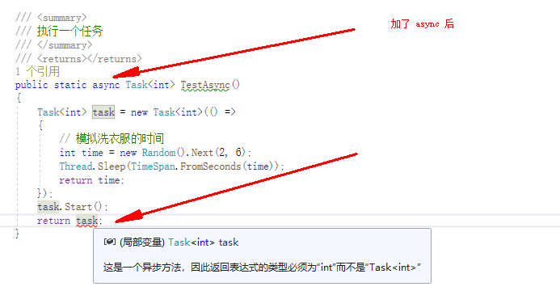

# 3.6 async 和 await

### 导读

扯淡了 这么多 篇，这篇终于开始学习 async 和 await 了，有了前面的基础，来理解 async 和 await 就容易理解多了。

这一篇一定要按照每一个示例，去写代码、执行、输出结果，自己尝试分析思路。

使用 `async/await` 的时候，初学者常常会出现很多使用误区，这里笔者都提及一下。


### async

微软文档：使用 `async` 修饰符可将方法、lambda 表达式或匿名方法指定为异步。

使用 async 修饰的方法，称为异步方法。

例如：

为了命名规范，使用 async 修饰的方法，需要在方法名称后面加上 `Async` 。

```csharp
public async Task<int> TestAsync()  
{  
    // . . . .  
}  
```

Lambda ：

```csharp

        static void Main()
        {
            Thread thread = new Thread(async () =>
            {
                await Task.Delay(0);
            });
        }
        public static async Task<int> TestAsync() => 666;
```

### await

微软文档：`await` 运算符暂停对其所属的 `async` 方法的求值，直到其操作数表示的异步操作完成。 

异步操作完成后，`await` 运算符将返回操作的结果（如果有），如果你使用了 await ，那么**这段代码相当于变成同步了**。


好的，到此为止，async 和 await ，就先说这么多。


## 从 Task 到 `async/await`

这里，你会跟笔者从以往文章中学习到的知识，去推导，去理解 async 和 await 这两个关键字是如何使用的，又应该怎么合理使用。

这里我们不参考文档和书籍的资料，不要看文档和书籍中的示例，我们要一步步来从任务(Task)中的同步异步开始，慢慢摸索。去分析 async 和 await 两个关键字给我们的异步编程带来了什么样的便利。


### 使用 Task 完成异步工作

下面这段代码，没有使用 async、await，但是它确确实实是异步的，因为两个线程可以同时运行，**一个线程不必阻塞等待另一个线程完成**。


场景：周六日放假了，可以打王者(一种游戏)，但是昨天的衣服还没有洗；于是用洗衣机洗衣服，清洗期间，开一局王者(一种游戏)。

我们可以编写一个示例如下：

```csharp
        static void Main()
        {
            Console.WriteLine("准备洗衣服");

            // 创建一个洗衣服的任务
            Task<int> task = new Task<int>(() =>
            {
                // 模拟洗衣服的时间
                int time = new Random().Next(2, 6);
                Thread.Sleep(TimeSpan.FromSeconds(time));
                return time;
            });

            Console.WriteLine("开始洗衣服");

            // 让洗衣机洗衣服
            task.Start();

            Console.WriteLine("我去打王者，让洗衣机洗衣服");
            // 打王者
            Thread.Sleep(TimeSpan.FromSeconds(4));
            Console.WriteLine("打完王者了，衣服洗完了嘛？");

            Console.WriteLine(task.IsCompleted);
            if (task.IsCompleted)
                Console.WriteLine("洗衣服花的时间：" + task.Result);
            else
            {
                Console.WriteLine("在等洗衣机洗完衣服");
                task.Wait();
                Console.WriteLine("洗衣服花的时间：" + task.Result);
            }
            Console.WriteLine("洗完了，捞出衣服，晒衣服，继续打王者去");
        }
```


### 带返回值的  Task

上面的示例，虽然说，异步完成了一个任务，但是这样，将代码都放到 Main ，可读性十分差，还要其它什么规范之类的，不允许我们写这样的垃圾代码。于是我们将洗衣服这个任务，封装到一个方法中，然后返回 Task 即可。

在 Program 类中，加入如下一个方法，这个方法用于执行任务，并且返回 Task 对象。

```csharp

        /// <summary>
        /// 执行一个任务
        /// </summary>
        /// <returns></returns>
        public static Task<int> TestAsync()
        {
            Task<int> task = new Task<int>(() =>
            {
                // 模拟洗衣服的时间
                int time = new Random().Next(2, 6);
                Thread.Sleep(TimeSpan.FromSeconds(time));
                return time;
            });
            task.Start();
            return task;
        }
```

Main 方法中，改成

```csharp
        static void Main()
        {
            Console.WriteLine("准备洗衣服");

            // 创建一个洗衣服的任务
            Task<int> task = TestAsync();
            ... ...
```


### 异步任务中的线程同步

我们创建了异步方法，去执行一个洗衣服的任务；当打完游戏后，需要检查任务是否完成，然后才能进行下一步操作，这时候就出现了 `同步`。为了保持同步和获得执行结果，我们使用了 `.Wait()` 、`.Result` 。

这里我们尝试将上面的操作转为同步，并且获得执行结果。

```csharp
    class Program
    {
        static void Main()
        {
            int time = Test();
            // ... ...
        }

        /// <summary>
        /// 执行一个任务
        /// </summary>
        /// <returns></returns>
        public static int Test()
        {
            Task<int> task = new Task<int>(() =>
            {
                // 模拟洗衣服的时间
                int time = new Random().Next(2, 6);
                Thread.Sleep(TimeSpan.FromSeconds(time));
                return time;
            });
            task.Start();
            return task.Result;
        }
    }
```


这里，讲解了 Task 的三种使用：

* 使用 Task 完成异步工作
* 带返回值的  Task
* 异步任务中的线程同步


这三个示例对理解后面的 `async/await` 很重要。


### 说说 await Task

`Task` 和 `Task<TResult>` ，前者是一个没有返回结果的任务，后者是有返回结果的任务。前面的文章中已经使用过大量的示例，这里我们使用 await ，去完成一些完全相同的功能。


`Task`：

```csharp
        public static void T1()
        {
            Task task = new Task(() => { });
            task.Wait();
        }
```

```csharp
        public static async void T2()
        {
            Task task = new Task(() => {  });
            await task;
        }
```

说明，await 可以让程序等待任务完成。

<br />

`Task<TResult>`：

 ```csharp
        public void T3()
        {
            // 获取 Task 任务对象，后面的逻辑过程可以弄成异步
            Task<int> task = TestAsync();

            // 任务是异步在执行，我不理会他
            // 这里可以处理其它事情，处理完毕后，再获取执行结果
            // 这就是异步

            Console.WriteLine(task.Result);
        }
 ```

```csharp
        public async void T4()
        {
            // 使用 await 关键字，代表等待执行完成，同步
            int time = await TestAsync();
            Console.WriteLine(time);
        }
```


await 可以让当前线程等待任务执行完成，并且获得执行结果。await 关键字，作用是让你等，是同步的，是阻塞的。


### 说说 `async Task<TResult>`

`async Task<TResult>` 修饰一个方法，那么这个方法要返回 `await Task<TResult>` 的结果。

 

两种同步方式示例对比：

```csharp
        public static int Test()
        {
            Task<int> task = new Task<int>(() =>
            {
                // 模拟洗衣服的时间
                int time = new Random().Next(2, 6);
                Thread.Sleep(TimeSpan.FromSeconds(time));
                return time;
            });
            task.Start();
            return task.Result;
        }
```

```csharp
        public static async Task<int> TestAsync()
        {
            Task<int> task = new Task<int>(() =>
            {
                // 模拟洗衣服的时间
                int time = new Random().Next(2, 6);
                Thread.Sleep(TimeSpan.FromSeconds(time));
                return time;
            });
            task.Start();
            int time = await task;
            return time;
        }
```


###  await 阻塞

当你的代码使用 await 时，你的代码会阻塞运行，此时，你的代码是同步代码，并不叫异步。

首先，在不使用 async 和 await 关键字的情况下，我们来编写两个方法，分别实现同步和异步的功能，两个方法执行的结果是一致的。

```csharp
        /// <summary>
        /// 同步
        /// </summary>
        /// <returns></returns>
        public static int Test()
        {
            Task<int> task = new Task<int>(() =>
            {
                return 666;
            });
            task.Start();
            return task.Result;
        }
        
        /// <summary>
        /// 异步
        /// </summary>
        /// <returns></returns>
        public static Task<int> TestAsync()
        {
            Task<int> task = new Task<int>(() =>
            {
                return 666;
            });
            task.Start();
            return task;
        }
```

能不能将两个方法合并在一起呢？想同步就同步，想异步就异步，这样就不需要写两个方法了！

是可以的！通过 async 和 await 关键字，可以轻松实现！

合并后，代码如下：

```csharp
        /// <summary>
        /// 可异步可同步
        /// </summary>
        /// <returns></returns>
        public static async Task<int> TestAsync()
        {
            Task<int> task = new Task<int>(() =>
            {
                return 666;
            });
            task.Start();
            return await task;
        }
```

合并后，我们又应该怎么在调用的时候，实现同步和异步呢？

笔者这里给出两个示例：

```csharp
        // await 使得任务同步
        public async void T1()
        {
            // 使用 await 关键字，代表等待执行完成，同步
            int time = await TestAsync();
            Console.WriteLine(time);
        }

        // 直接获得返回的 Task，实现异步
        public void T2()
        {
            // 获取 Task 任务对象，后面的逻辑过程可以弄成异步
            Task<int> task = TestAsync();

            // 任务是异步在执行，我不理会他
            // 这里可以处理其它事情，处理完毕后，再获取执行结果
            // 这就是异步

            Console.WriteLine(task.Result);
        }

```

至此，理解为什么使用了 `async` 和 `await`，执行时还是同步了吧？


### Task 封装异步任务

前面，我们都是使用了 `new Task()` 来创建任务，而且微软官网大多使用 `Task.Run()` 来编写 async 和 await 的示例。

因此，我们可以修改前面的异步任务，改成：

```csharp
        /// <summary>
        /// 可异步可同步
        /// </summary>
        /// <returns></returns>
        public static async Task<int> TestAsync()
        {
            return await Task.Run<int>(() =>
            {
                return 666;
            });
        }
```

但是这种代码没啥意义。


### `async Task` 污染

在百度学习异步的时候，往往会有作者说，进入异步方法后，同步执行代码，碰到 await 后就是异步执行。

当然还有多种说法。


我们已经学习了这么多的任务(Task)知识，这一点十分容易解释。

因为使用了 async 和 await 关键字，代码最深处，必定会出现 Task 这个东西，Task 这个东西本来就是异步。碰到 await 出现异步，不是因为 await 的作用，而是因为最底层有个 Task。


如果你的一个方法使用了 `async Task`，那么调用了这个方法的其它方法，可能都需要使用 `async Task`，一定程度上会导致 ”代码污染“。


## 正确使用 `async/await`


### 异步执行代码

下面的代码是  `async/await` 代码。

```csharp
    static async Task Main()
    {
        await Run();
        Console.WriteLine("Main");
    }
    public static async Task Run()
    {
        // 执行工作
        Thread.Sleep(1000);
        Console.WriteLine("Run");
        await Task.CompletedTask;
    }
```

那么其实 Main 的代码是同步代码，不是异步代码。因为 Main 必须完全等待 Run 完成，而期间 Main 方法不能做其它事情，两个线程没有并发，怎么异步？


如果你改成：

```csharp
static async Task Main()
{
    // 执行任务，这里不使用 await 关键字，让任务异步运行
    var task = Run();
    // 执行一下 Main 的代码
    Console.WriteLine("Main");

    // 使用 await 等待另一个线程完成。
    await task;
}
public static async Task Run()
{
    // 执行工作
    Thread.Sleep(1000);
    Console.WriteLine("Run");
    await Task.CompletedTask;
}
```


### 异步 IO

前面提到了 Task、async、await 这些东西，完全没有提到性能相关的说法，因为就算用上了这些东西，也不会提高什么性能。

首先我们区分任务是计算密集型还是 IO 密集型，当涉及到网络、文件这些 IO 操作时，使用系统的异步 API ，可以提高性能。


这里涉及到计算机组成原理。CPU 很快，而 CPU 跟内存的速度差了几个数量级，因此 CPU 每次执行指令都要从内存中取数据的话，会严重拖慢 CPU，因此出现了多级 CPU 缓存。

计算机中存在着 DMA 芯片，称为协处理器，它可以让内存与设备之间完成 IO 传输，而不需要 CPU 一直参与。

例如， CPU 执行指令从磁盘文件中加载文件到内存中，CPU 可以下方指令，然后 DMA 芯片控制内存跟 IO 设备传输数据，CPU 可以去执行其它任务，等 IO 操作完成，CPU 再回来执行接下来的指令。这一过程即 IO 异步。 


如果你的代码不会使用到 IO 操作，那么你写的 `async/awaiit`，也只是完成异步代码，不会带来性能上的提升。          


在 C#  中，执行一个异步 IO 代码的示例如下：

```csharp
    static async Task Main()
    {
        var stream = File.OpenRead("D:/a.txt");
        string content = await new StreamReader(stream).ReadToEndAsync();
    }
```

