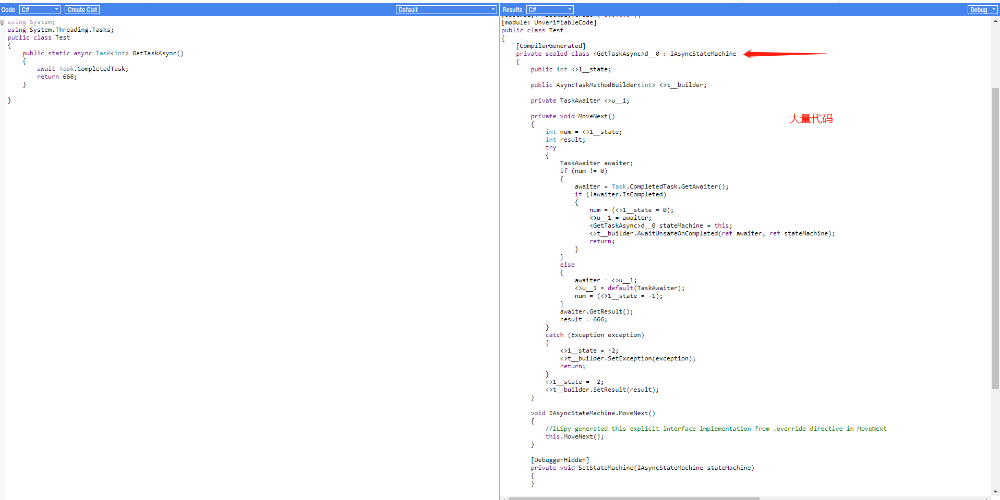

#  3.6 ValueTask

`ValueTask`/`ValueTask<TResult>` 出现时间其实比较早的了，之前一直没有深入，借此机会好好学习一番。

文章中说 ValueTask 时，为了减少文字数量，一般包括其泛型版本 `ValueTask<TRsult>`；提到 Task，也包括其泛型版本；


### 1，可用版本与参考资料

根据 Microsoft 官网的参考资料，以下版本的 .NET 程序(集)可以使用 `ValueTask/ValueTask<TResult>`。

| 版本类别      | 版本要求      |
| :------------ | :------------ |
| .NET          | 5.0           |
| .NET Core     | 2.1、3.0、3.1 |
| .NET Standard | 2.1           |

以下是笔者阅读时的参考资料链接地址：

【1】  [https://docs.microsoft.com/zh-cn/dotnet/api/system.threading.tasks.valuetask?view=net-5.0](https://docs.microsoft.com/zh-cn/dotnet/api/system.threading.tasks.valuetask?view=net-5.0)

【2]】 [https://docs.microsoft.com/zh-cn/dotnet/api/system.threading.tasks.valuetask-1?view=net-5.0](https://docs.microsoft.com/zh-cn/dotnet/api/system.threading.tasks.valuetask-1?view=net-5.0)

【3】  [https://www.infoworld.com/article/3565433/how-to-use-valuetask-in-csharp.html](https://www.infoworld.com/article/3565433/how-to-use-valuetask-in-csharp.html)

【4】  [https://tooslowexception.com/implementing-custom-ivaluetasksource-async-without-allocations/](https://tooslowexception.com/implementing-custom-ivaluetasksource-async-without-allocations/)

【5】 [https://blog.marcgravell.com/2019/08/prefer-valuetask-to-task-always-and.html](https://blog.marcgravell.com/2019/08/prefer-valuetask-to-task-always-and.html)

【6】  [https://qiita.com/skitoy4321/items/31a97e03665bd7bcc8ca](https://qiita.com/skitoy4321/items/31a97e03665bd7bcc8ca)

【7】  [https://neuecc.medium.com/valuetasksupplement-an-extensions-to-valuetask-4c247bc613ea](https://neuecc.medium.com/valuetasksupplement-an-extensions-to-valuetask-4c247bc613ea)

【8】[https://github.com/dotnet/coreclr/blob/master/src/System.Private.CoreLib/shared/System/Threading/Tasks/Sources/ManualResetValueTaskSourceCore.cs](https://github.com/dotnet/coreclr/blob/master/src/System.Private.CoreLib/shared/System/Threading/Tasks/Sources/ManualResetValueTaskSourceCore.cs)


### 2，`ValueTask<TResult>` 和 Task

`ValueTask<TResult>` 存在于 `System.Threading.Tasks` 命名空间下，`ValueTask<TResult>` 的定义如下：

```csharp
public struct ValueTask<TResult> : IEquatable<ValueTask<TResult>>
```

<div style="color: rgb(23, 23, 23); font-family: &quot;Segoe UI&quot;, SegoeUI, &quot;Segoe WP&quot;, &quot;Helvetica Neue&quot;, Helvetica, Tahoma, Arial, sans-serif; background-color: rgb(255, 241, 204);border-radius: 10px;padding:20px;">
笔者注：IEquatable&lt;T&gt; 接口定义 Equals 方法，用于确定两个实例是否相等。</div>


而 Task 的定义如下：

```csharp
public class Task : IAsyncResult, IDisposable
```


从其继承的接口和官方文档来看，`ValueTask<TResult>` 复杂度应该不高。

根据文档表面理解，这个类型，应该是 Task 的简化版本，Task 是引用类型，因此从异步方法返回 Task 对象或者每次调用异步方法时，都会在托管堆中分配该对象。

根据比较，我们应当知道：

* Task 是引用类型，会在托管堆中分配内存；ValueTask 是值类型；

目前就只有这一点需要记住，下面我们继续比较两者的异同点。


这里我们尝试一下使用这个类型对比 Task ，看看代码如何。

```csharp
        public static async ValueTask<int> GetValueTaskAsync()
        {
            await Task.CompletedTask;	// 这里别误会，这是随便找个地方 await 一下
            return 666;
        }

        public static async Task<int> GetTaskAsync()
        {
            await Task.CompletedTask;
            return 666;
        }
```

从代码上看，两者在简单代码上使用的方法一致(CURD基本就是这样)。

### 3，编译器如何编译

Task 在编译时，由编译器生成状态机，会为每个方法生成一个继承 `IAsyncStateMachine` 的类，并且出现大量的代码包装。

据笔者测试，ValueTask 也是生成类似的代码。

如图：



访问 [https://sharplab.io/#gist:ddf2a5e535a34883733196c7bf4c55b2](https://sharplab.io/#gist:ddf2a5e535a34883733196c7bf4c55b2) 可在线阅读以上代码(Task)。

访问 [https://sharplab.io/#gist:7129478fc630a87c08ced38e7fd14cc0](https://sharplab.io/#gist:7129478fc630a87c08ced38e7fd14cc0) 在线阅读 ValueTask 示例代码。

你分别访问这里 URL，对比差异。

笔者将有差异的部分取出来了，读者可以认真看一下：

**Task**：

```csharp
    [AsyncStateMachine(typeof(<GetTaskAsync>d__0))]
    [DebuggerStepThrough]
    public static Task<int> GetTaskAsync()
    {
        <GetTaskAsync>d__0 stateMachine = new <GetTaskAsync>d__0();
        stateMachine.<>t__builder = AsyncTaskMethodBuilder<int>.Create();
        stateMachine.<>1__state = -1;
        AsyncTaskMethodBuilder<int> <>t__builder = stateMachine.<>t__builder;
        <>t__builder.Start(ref stateMachine);
        return stateMachine.<>t__builder.Task;
    }
```

**ValueTask**：

```csharp
    [AsyncStateMachine(typeof(<GetValueTaskAsync>d__0))]
    [DebuggerStepThrough]
    public static ValueTask<int> GetValueTaskAsync()
    {
        <GetValueTaskAsync>d__0 stateMachine = new <GetValueTaskAsync>d__0();
        stateMachine.<>t__builder = AsyncValueTaskMethodBuilder<int>.Create();
        stateMachine.<>1__state = -1;
        AsyncValueTaskMethodBuilder<int> <>t__builder = stateMachine.<>t__builder;
        <>t__builder.Start(ref stateMachine);
        return stateMachine.<>t__builder.Task;
    }
```

我是没看出有啥区别。。。

不过这里要提到第二点：

* 如果这个方法的处理速度很快，或者你的代码执行后立即可用等，使用异步并不会比同步快，反而有可能多消耗一下性能资源。


### 4，ValueTask 有什么优势

从前面的内容可知，ValueTask 跟 Task 编译后生成的状态机代码一致，那么真正有区别的地方，就是 ValueTask 是值类型，Task 是引用类型。

从功能上看，ValueTask 是简单的异步表示，而 Task 具有很多强大的方法，有各种各样的骚操作。

ValueTask 因为不需要堆分配内存而提高了性能，这是 ValueTask 对 Task 有优势的地方。

要避免内存分配开销，我们可以使用 ValueTask 包装需要返回的结果。

```csharp
        public static ValueTask<int> GetValueTask()
        {
            return new ValueTask<int>(666);
        }

        public static async ValueTask<int> StartAsync()
        {
            return await GetValueTask();
        }
```

但是目前，我们还没有进行任何性能测试，不足以说明 ValueTask 对提高性能的优势，笔者继续讲解一些基础知识，待时机成熟后，会进行一些测试并放出示例代码。


### 5，ValueTask 创建异步任务

我们看一下 `ValueTask` 和 `ValueTask<TResult>` 的构造函数定义。

```csharp
// ValueTask
        public ValueTask(Task task);
        public ValueTask(IValueTaskSource source, short token);

// ValueTask<TResult>
        public ValueTask(Task<TResult> task);
        public ValueTask(TResult result);
        public ValueTask(IValueTaskSource<TResult> source, short token);
```

如果通过 Task 创建任务，可以使用 `new Task()` 、`Task.Run()` 等方式创建一个任务，然后就可以使用 `async/await` 关键字 定义异步方法，开启异步任务。那么如果使用 ValueTask 呢？

第四小节我们已经有了示例，使用了 `ValueTask(TResult result)`  构造函数，可以自己 `new ValueTask` ，然后就可以使用 `await` 关键字。

另外， ValueTask 的构造函数有多个，我们可以继续挖掘一下。

**通过 Task 转换为 ValueTask**：

```csharp
        public static async ValueTask<int> StartAsync()
        {
            Task<int> task = Task.Run<int>(() => 666);
            return await new ValueTask<int>(task);
        }
```


剩下一个 `IValueTaskSource` 参数类型做构造函数的方法，我们放到第 6 小节讲。

<div style="color: rgb(23, 23, 23); font-family: &quot;Segoe UI&quot;, SegoeUI, &quot;Segoe WP&quot;, &quot;Helvetica Neue&quot;, Helvetica, Tahoma, Arial, sans-serif; background-color: rgb(255, 241, 204);border-radius: 10px;padding:20px;">
 ValueTask 实例仅可等待一次！必须记住这一点！</div>


### 6，IValueTaskSource 和自定义包装 ValueTask

#### 关于 IValueTaskSource 

IValueTaskSource 在 `System.Threading.Tasks.Sources` 命名空间中，其定义如下：

```csharp
    public interface IValueTaskSource
    {
        void GetResult(short token);

        ValueTaskSourceStatus GetStatus(short token);

        void OnCompleted(
            Action<object?> continuation, 
            object? state, 
            short token, 
            ValueTaskSourceOnCompletedFlags flags);
    }
```

| 方法名称                                                     | 作用                                                         |
| ------------------------------------------------------------ | ------------------------------------------------------------ |
| GetResult(Int16)                                             | 获取 IValueTaskSource 的结果，**仅在异步状态机需要获取操作结果时调用一次** |
| GetStatus(Int16)                                             | 获取当前操作的状态，**由异步状态机调用以检查操作状态**       |
| OnCompleted(Action, Object, Int16, ValueTaskSourceOnCompletedFlags) | 为此 IValueTaskSource 计划延续操作，**开发者自己调用**       |

在这个命名空间中，还有一些跟 ValueTask 相关的类型，可参考 [微软文档](https://docs.microsoft.com/zh-cn/dotnet/api/system.threading.tasks.sources.ivaluetasksource?view=net-5.0)。

在上述三个方法中，`OnCompleted` 用于延续任务，这个方法熟悉 Task 的读者应该都清楚，这里就不再赘述。


前面我们有一个示例：

```csharp
        public static ValueTask<int> GetValueTask()
        {
            return new ValueTask<int>(666);
        }

        public static async ValueTask<int> StartAsync()
        {
            return await GetValueTask();
        }
```

编译器转换后的简化代码：

```csharp
        public static int _StartAsync()
        {
            var awaiter = GetValueTask().GetAwaiter();
            if (!awaiter.IsCompleted)
            {
                // 一些莫名其妙的操作代码
            }

            return awaiter.GetResult();
        }
```

基于这个代码，我们发现 ValueTask 可以有状态感知，那么如何表达任务已经完成？里面又有啥实现原理？


#### 什么是 IValueTaskSource

IValueTaskSource 是一种抽象，通过这种抽象我们可以将 **任务/操作** 的逻辑行为和结果本身分开表示(状态机)。

简化示例：

```csharp
IValueTaskSource<int> someSource = // ...
short token =                      // ...令牌
var vt = new ValueTask<int>(someSource, token);  // 创建任务
int value = await vt;						     // 等待任务完成
```

但从这段代码来看，我们无法看到 如何实现 IValueTaskSource，ValueTask 内部又是如何使用 IValueTaskSource 的。在深入其原理之前，笔者从其它博客、文档等地方查阅到，为了降低 Task(C#5.0引入) 的性能开销，C# 7.0 出现了 ValueTask。ValueTask 的出现是为了包装返回结果，避免使用堆分配。

所以，需要使用 Task 转换为 ValueTask：

```csharp
public ValueTask(Task task);		// ValueTask 构造函数
```

ValueTask 只是包装 Task 的返回结果。


后来，为了更高的性能，引入了 IValueTaskSource，ValueTask 便多增加了一个构造函数。

可以通过实现 IValueTaskSource：

```csharp
public ValueTask(IValueTaskSource source, short token);    // ValueTask 构造函数
```

这样，可以进一步消除 ValueTask 跟 Task 转换的性能开销。ValueTask 便拥有状态“管理”能力，不再依赖 Task 。


#### 再说 ValueTask 优势

2019-8-22 的 coreclr 草案中，有个主题 “Make "async ValueTask/ValueTask<T>" methods ammortized allocation-free”，深入探讨了 ValueTask 的性能影响以及后续改造计划。

Issue 地址：[https://github.com/dotnet/coreclr/pull/26310](https://github.com/dotnet/coreclr/pull/26310)

里面有各种各样的性能指标比较，笔者十分推荐有兴趣深入研究的读者看一下这个 Issue。


#### 不要自己全部实现 IValueTaskSource

大多数人无法完成这个接口，我个人看来很多次也没有看懂，翻了很久，没有找到合适的代码示例。根据官方的文档，我发现了 `ManualResetValueTaskSourceCore`，这个类型实现了 `IValueTaskSource` 接口，并且进行了封装，因此我们可以使用 `ManualResetValueTaskSourceCore` 对自己的代码进行包装，更加轻松地实现 IValueTaskSource。

关于 `ManualResetValueTaskSourceCore`  ，文章后面再给出使用方法和代码示例。


#### ValueTaskSourceOnCompletedFlags 

ValueTaskSourceOnCompletedFlags  是一个枚举，用于表示延续的行为，其枚举说明如下：

| 枚举                 | 值   | 说明                                                         |
| -------------------- | ---- | ------------------------------------------------------------ |
| FlowExecutionContext | 2    | `OnCompleted` 应捕获当前 ExecutionContext 并用它来运行延续。 |
| None                 | 0    | 对延续的调用方式内有任何要求。                               |
| UseSchedulingContext | 1    | `OnCompleted` 应该捕获当前调度上下文（SynchronizationContext），并在将延续加入执行队列时使用。 如果未设置此标志，实现可以选择执行任意位置的延续。 |

#### ValueTaskSourceStatus 

ValueTaskSourceStatus 枚举用于指示 指示 IValueTaskSource 或 IValueTaskSource 的状态，其枚举说明如下：

| 枚举      | 值   | 说明                   |
| --------- | ---- | ---------------------- |
| Canceled  | 3    | 操作因取消操作而完成。 |
| Faulted   | 2    | 操作已完成但有错误。   |
| Pending   | 0    | 操作尚未完成。         |
| Succeeded | 1    | 操作已成功完成。       |


### 7，编写 IValueTaskSource 实例

完整代码：[https://github.com/whuanle/RedisClientLearn/issues/1](https://github.com/whuanle/RedisClientLearn/issues/1)

假如我们要设计一个 Redis 客户端，并且实现异步，如果你有 Socket 开发经验，会了解 Socket 并不是 一发一收的。C# 中的 Socket 中也没有直接的异步接口。

所以这里我们要实现一个异步的 Redis 客户端。

使用 IValueTaskSource  编写状态机：

```csharp
    // 一个可以将同步任务、不同线程同步操作，通过状态机构建异步方法
    public class MyValueTaskSource<TRusult> : IValueTaskSource<TRusult>
    {
        // 存储返回结果
        private TRusult _result;
        private ValueTaskSourceStatus status = ValueTaskSourceStatus.Pending;

        // 此任务有异常
        private Exception exception;

        #region 实现接口，告诉调用者，任务是否已经完成，以及是否有结果，是否有异常等
        // 获取结果
        public TRusult GetResult(short token)
        {
            // 如果此任务有异常，那么获取结果时，重新弹出
            if (status == ValueTaskSourceStatus.Faulted)
                throw exception;
            // 如果任务被取消，也弹出一个异常
            else if (status == ValueTaskSourceStatus.Canceled)
                throw new TaskCanceledException("此任务已经被取消");

            return _result;
        }

        // 获取状态，这个示例中，用不到令牌 token
        public ValueTaskSourceStatus GetStatus(short token)
        {
            return status;
        }

        // 实现延续
        public void OnCompleted(Action<object> continuation, object state, short token, ValueTaskSourceOnCompletedFlags flags)
        {
            // 不需要延续，不实现此接口
        }

        #endregion

        #region 实现状态机，能够控制此任务是否已经完成，以及是否有异常

        // 以及完成任务，并给出结果
        public void SetResult(TRusult result)
        {
            status = ValueTaskSourceStatus.Succeeded;  // 此任务已经完成
            _result = result;
        }

        // 取消任务
        public void Cancel()
        {
            status = ValueTaskSourceStatus.Canceled;
        }

        // 要执行的任务出现异常
        public void SetException(Exception exception)
        {
            this.exception = exception;
            status = ValueTaskSourceStatus.Faulted;
        }

        #endregion

    }
```


假的 Socket：

```csharp
    public class 假的Socket
    {
        private bool IsHaveSend = false;

        // 模拟 Socket 向服务器发送数据
        public void Send(byte[] data)
        {
            new Thread(() =>
            {
                Thread.Sleep(100);
                IsHaveSend = true;
            }).Start();
        }

        // 同步阻塞等待服务器的响应
        public byte[] Receive()
        {
            // 模拟网络传输的数据
            byte[] data = new byte[100];

            while (!IsHaveSend)
            {
                // 服务器没有发送数据到客户端时，一直空等待
            }

            // 模拟网络接收数据耗时
            Thread.Sleep(new Random().Next(0, 100));
            new Random().NextBytes(data);
            IsHaveSend = false;
            return data;
        }
    }
```

实现 Redis 客户端，并且实现

```csharp
    // Redis 客户端
    public class RedisClient
    {
        // 队列
        private readonly Queue<MyValueTaskSource<string>> queue = new Queue<MyValueTaskSource<string>>();

        private readonly 假的Socket _socket = new 假的Socket();  // 一个 socket 客户端

        public RedisClient(string connectStr)
        {
            new Thread(() =>
            {
                while (true)
                {
                    byte[] data = _socket.Receive();
                    // 从队列中拿出一个状态机
                    if (queue.TryDequeue(out MyValueTaskSource<string> source))
                    {
                        // 设置此状态机的结果
                        source.SetResult(Encoding.UTF8.GetString(data));
                    }
                }
            }).Start();
        }

        private void SendCommand(string command)
        {
            Console.WriteLine("客户端发送了一个命令:" + command);
            _socket.Send(Encoding.UTF8.GetBytes(command));
        }

        public async ValueTask<string> GetStringAsync(string key)
        {
            // 自定义状态机
            MyValueTaskSource<string> source = new MyValueTaskSource<string>();
            // 创建异步任务
            ValueTask<string> task = new ValueTask<string>(source, 0);

            // 加入队列中
            queue.Enqueue(source);

            // 发送获取值的命令
            SendCommand($"GET {key}");

            // 直接使用 await ，只会检查移除状态！一层必须在检查之前完成任务，然后 await 后会陷入无限等待中！
            // return await task;

            // 要想真正实现这种异步，必须使用 SynchronizationContext 等复杂的结构逻辑！
            // 为了避免过多代码，我们可以使用下面这种 无限 while 的方法！
            var awaiter = task.GetAwaiter();
            while (!awaiter.IsCompleted) { }

            // 返回结果
            return await task;
        }
    }
```


大概思路就是这样。但是最后是无法像 Task 那样直接 await 的！ValueTask 只能 await 一次，并且 await 只能是最后的结果检查！

如果我们使用 `TaskCompletionSource` 写 Task 状态机，是可以直接 await 的。

如果你要真正实现可以 await 的 ValueTask，那么编写 `IValueTasksource` 时，必须实现 `SynchronizationContext`、`TaskScheduler ` 等。

实现这些代码，比较复杂，怎么办？微软官方给出了一个`ManualResetValueTaskSourceCore<TResult>`，有了它，我们可以省去很多复杂的代码！

<div style="color: rgb(23, 23, 23); font-family: &quot;Segoe UI&quot;, SegoeUI, &quot;Segoe WP&quot;, &quot;Helvetica Neue&quot;, Helvetica, Tahoma, Arial, sans-serif; background-color: rgb(255, 241, 204);border-radius: 10px;padding:20px;">
 ValueTask 是不可被取消的！</div>


### 8，使用 ManualResetValueTaskSourceCore

接下来，我们通过 `ManualResetValueTaskSourceCore` 改造以往的代码，这样我们可以直观的感受到这个类型是用来干嘛的！

改造 `MyValueTaskSource` 如下：

```csharp
    // 一个可以将同步任务、不同线程同步操作，通过状态机构建异步方法
    public class MyValueTaskSource<TRusult> : IValueTaskSource<TRusult>
    {
        private ManualResetValueTaskSourceCore<TRusult> _source = new ManualResetValueTaskSourceCore<TRusult>();

        #region 实现接口，告诉调用者，任务是否已经完成，以及是否有结果，是否有异常等
        // 获取结果
        public TRusult GetResult(short token)
        {
            return _source.GetResult(token);
        }

        // 获取状态，这个示例中，用不到令牌 token
        public ValueTaskSourceStatus GetStatus(short token)
        {
            return _source.GetStatus(token); ;
        }

        // 实现延续
        public void OnCompleted(Action<object> continuation, object state, short token, ValueTaskSourceOnCompletedFlags flags)
        {
            _source.OnCompleted(continuation, state, token, flags);
        }

        #endregion

        #region 实现状态机，能够控制此任务是否已经完成，以及是否有异常

        // 以及完成任务，并给出结果
        public void SetResult(TRusult result)
        {
            _source.SetResult(result);
        }

        // 要执行的任务出现异常
        public void SetException(Exception exception)
        {
            _source.SetException(exception);
        }

        #endregion
    }
```


之后，我们可以直接在 `GetStringAsync` 使用 await 了！

```csharp
        public async ValueTask<string> GetStringAsync(string key)
        {
            // 自定义状态机
            MyValueTaskSource<string> source = new MyValueTaskSource<string>();
            // 创建异步任务
            ValueTask<string> task = new ValueTask<string>(source, 0);

            // 加入队列中
            queue.Enqueue(source);

            // 发送获取值的命令
            SendCommand($"GET {key}");

            return await task;
        }
```


到此为止，ValueTask、IValueTaskSource、ManualResetValueTaskSourceCore，你搞明白了没有！


有人给 ValueTask 实现了大量拓展，使得 ValueTask 拥有跟 Task 一样多任务并发能力，例如 WhenAll、WhenAny、Factory等，拓展库地址：[https://github.com/Cysharp/ValueTaskSupplement](https://github.com/Cysharp/ValueTaskSupplement)
