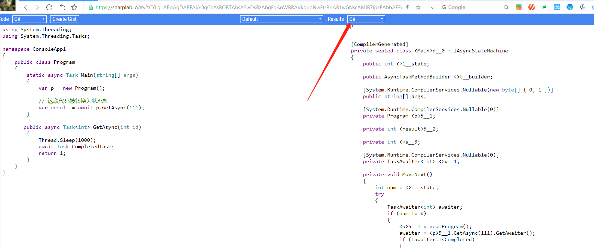

# 3.8 编写异步状态机

在前面，笔者强调过很多次，async、await 只是语法糖，当 .NET SDK 编译 C# 代码时，async、await 会被转换为对应的代码，然后再编译成 IL 代码。
那么在本章中，笔者将为大家介绍编译器去掉 async、await 的之后的代码，我们又应该如何编写应该这样的状态机，以便加深大家对 Task 任务调度的理解。

### async、await 变成了什么

下面是一段很简单的代码：


```csharp
using System.Threading;
using System.Threading.Tasks;

namespace ConsoleApp1
{
	public class Program
	{
		static async Task Main(string[] args)
		{
			var p = new Program();

			// 这段代码被转换为状态机
			var result = await p.GetAsync(111);
		}

		public async Task<int> GetAsync(int id)
		{
			Thread.Sleep(1000);
			await Task.CompletedTask;
			return 1;
		}
	}
}
```

如果我们去掉语法糖，那么这个代码会是什么样子呢？
我们可以打开 https://sharplab.io/ ，将代码填充进去。



可以看到，如果去掉语法糖，生成的代码竟然如此复杂。


### 实现异步状态机

在本小节，我们将会实现一个异步状态机。

首先是异步状态机的接口 `IAsyncStateMachine` 定义如下：
表示为异步方法生成的状态机。此类型仅供编译器使用。

```csharp
using System.Runtime.CompilerServices;

public interface IAsyncStateMachine
{
	// 将状态机移动到下一个状态
	void MoveNext();

	// 使用堆分配的副本配置状态机
	void SetStateMachine(IAsyncStateMachine stateMachine);
}
```

创建一个名为 GGG 的结构体。

```csharp
	[CompilerGenerated]
	public struct GGG : IAsyncStateMachine
	{
	}
```


为了便于理解，我们首先只需要将下面这段代码转换为异步状态机的写法即可：

```csharp
            var result = await p.GetAsync(111);
```


在实现状态机时，首先要提取两个信息：
1，调用者对象
2，调用方法传递的参数

```csharp
	[CompilerGenerated]
	public struct GGG : IAsyncStateMachine
	{
		public Program __this;
		public int id;
	}
```

然后在 Main 方法中，可以这样实例化状态机：

```csharp
            // p. (111);
			GGG g = new GGG()
			{
				__this = p,
				id = 111
			};
```


因为我们要调用一个异步方法，所以我们需要将这个方法放到异步任务队列之中，并且能够知道任务是否完成。

这个时候就需要使用 `AsyncTaskMethodBuilder<int>`， 表示返回任务的异步方法的生成器，其中里面的泛型指的是返回类型。


```csharp

	[CompilerGenerated]
	public struct GGG : IAsyncStateMachine
	{
		// 调用方和参数
		public Program __this;
		public int id;
		
		// 异步方法生成器
		public AsyncTaskMethodBuilder<int> __builder;
	}
```
> 你可以使用结构体，也可以使用类，效果都是一样的。

创建异步方法调用器。
```csharp
		static async Task Main(string[] args)
		{
			var p = new Program();

			// 这段代码被转换为状态机
			// await p.GetAsync(111);

			GGG g = new GGG()
			{
				__this = p,
				id = 111
			};

			g.__builder = AsyncTaskMethodBuilder<int>.Create();
		}
```

接着，调用方法和获取返回结果，我们需要多加三个字段：

```csharp
	[CompilerGenerated]
	public struct GGG : IAsyncStateMachine
	{
		// 调用方和参数
		public Program __this;
		public int id;
		
		// 异步方法生成器
		public AsyncTaskMethodBuilder<int> __builder;
		
		// 异步任务的状态
		public int __state;
		
		// 要调用的异步方法
		private TaskAwaiter<int> __task1Awaiter;
		
		// 调用方法返回的值
		private int result;
	}
```


接下来我们要实现状态机的 `MoveNext()` 方法。


```csharp
	[CompilerGenerated]
	public struct GGG : IAsyncStateMachine
	{
		// 调用方和参数
		public Program __this;
		public int id;
		
		// 异步方法生成器
		public AsyncTaskMethodBuilder<int> __builder;
		
		// 异步任务的状态
		public int __state;
		
		// 要调用的异步方法
		private TaskAwaiter<int> __task1Awaiter;
		
		// 调用方法返回的值
		private int result;
		
		//
		public void MoveNext()
		{
			try
			{
				TaskAwaiter<int> awaiter;
				if (__state != 0)
				{
					if (id == 0) throw new ArgumentNullException(nameof(id));
					
					// 要调用的方法，此时方法已经开始被执行
					awaiter = __this.GetAsync(id).GetAwaiter();
					
					// 如果该方法还没有执行完成，则开始调度到任务队列
					if (!awaiter.IsCompleted)
					{
						__state = 0;
						__task1Awaiter = awaiter;
						// 没有完成的话，放到后台完成
						__builder.AwaitUnsafeOnCompleted(ref awaiter, ref this);
						return;
					}
				}
				// 如果该方法已经被执行完成
				else
				{
					awaiter = __task1Awaiter;
					__task1Awaiter = default(TaskAwaiter<int>);
					__state = -1;
				}
				result = awaiter.GetResult();
			}
			catch (Exception ex)
			{
				__state = -2;
				__builder.SetException(ex);
				return;
			}

			__state = -2;
			__builder.SetResult(result);
		}


		[DebuggerHidden]
		void IAsyncStateMachine.SetStateMachine(IAsyncStateMachine stateMachine)
		{
			__builder.SetStateMachine(stateMachine);
		}
	}
```

接着，我们便可以使用 `AsyncTaskMethodBuilder.Start()` 执行异步方法了，`.Start()` 被调用时，开始使用关联的状态机运行生成器。
> `Start<TStateMachine>(TStateMachine)` 。

```csharp
		static async Task Main(string[] args)
		{
			var p = new Program();

			// 这段代码被转换为状态机
			// await p.GetAsync(111);

			GGG g = new GGG()
			{
				__this = p,
				id = 111
			};
			g.__builder = AsyncTaskMethodBuilder<int>.Create();
			g.__state = -1;

			// 这里开始调用
			g.__builder.Start(ref g);		
			var task = g.__builder.Task;
		}

```

`AsyncTaskMethodBuilder.Start()` 的核心功能是，设置线程上下文，并执行我们状态机的 `MoveNext()` 方法。

```csharp
[DebuggerStepThrough]
public static void Start<TStateMachine>(ref TStateMachine stateMachine) where TStateMachine : IAsyncStateMachine
{
	if (stateMachine == null)
	{
		ThrowHelper.ThrowArgumentNullException(ExceptionArgument.stateMachine);
	}
	Thread currentThread = Thread.CurrentThread;
	ExecutionContext executionContext = currentThread._executionContext;
	SynchronizationContext synchronizationContext = currentThread._synchronizationContext;
	try
	{
		// 这里是我们状态机的方法
		stateMachine.MoveNext();
	}
	finally
	{
		if (synchronizationContext != currentThread._synchronizationContext)
		{
			currentThread._synchronizationContext = synchronizationContext;
		}
		ExecutionContext executionContext2 = currentThread._executionContext;
		if (executionContext != executionContext2)
		{
			ExecutionContext.RestoreChangedContextToThread(currentThread, executionContext, executionContext2);
		}
	}
}

```

当程序执行 `AsyncTaskMethodBuilder.Start()` 时，当前线程就会被挂起，当方法执行完毕后，才会执行后面的代码。
```csharp
g.__builder.Start(ref g);
```

完整代码示例如下。

```csharp
namespace ConsoleApp1
{
	public class Program
	{
		static async Task Main(string[] args)
		{
			var p = new Program();

			// 这段代码被转换为状态机
			// await p.GetAsync(111);

			GGG g = new GGG()
			{
				__this = p,
				id = 111
			};
			g.__builder = AsyncTaskMethodBuilder<int>.Create();
			g.__state = -1;
			
			// 这里会等待方法执行完成
			g.__builder.Start(ref g);
			
			// 方法执行完成后才到这里
			var task = g.__builder.Task;
			var result = task.Result;
		}

		public async Task<int> GetAsync(int id)
		{
			Thread.Sleep(10000);
			await Task.CompletedTask;
			return 1;
		}
	}

	[CompilerGenerated]
	public struct GGG : IAsyncStateMachine
	{
		// 调用方和参数
		public Program __this;
		public int id;
		
		// 异步方法生成器
		public AsyncTaskMethodBuilder<int> __builder;
		
		// 异步任务的状态
		public int __state;
		
		// 要调用的异步方法
		private TaskAwaiter<int> __task1Awaiter;
		
		// 调用方法返回的值
		private int result;
		
		//
		public void MoveNext()
		{
			try
			{
				TaskAwaiter<int> awaiter;
				if (__state != 0)
				{
					if (id == 0) throw new ArgumentNullException(nameof(id));
					
					// 要调用的方法，此时方法已经开始被执行
					awaiter = __this.GetAsync(id).GetAwaiter();
					
					// 如果该方法还没有执行完成，则开始调度到任务队列
					if (!awaiter.IsCompleted)
					{
						__state = 0;
						__task1Awaiter = awaiter;
						// 没有完成的话，放到后台完成
						__builder.AwaitUnsafeOnCompleted(ref awaiter, ref this);
						return;
					}
				}
				// 如果该方法已经被执行完成
				else
				{
					awaiter = __task1Awaiter;
					__task1Awaiter = default(TaskAwaiter<int>);
					__state = -1;
				}
				result = awaiter.GetResult();
			}
			catch (Exception ex)
			{
				__state = -2;
				__builder.SetException(ex);
				return;
			}

			__state = -2;
			__builder.SetResult(result);
		}


		[DebuggerHidden]
		void IAsyncStateMachine.SetStateMachine(IAsyncStateMachine stateMachine)
		{
			__builder.SetStateMachine(stateMachine);
		}
	}

}
```

