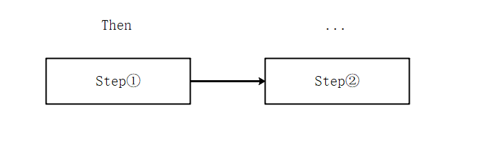

# 4.5 工作流引擎

## 导读

前面学习了很多多线程和任务的基础知识，这里要来实践一下啦。通过本篇教程，你可以写出一个简单的工作流引擎。

本篇教程内容完成是基于任务的，只需要看过笔者的三篇关于异步的文章，掌握 C# 基础，即可轻松完成。

* [C#多线程(13)：任务基础①](https://www.cnblogs.com/whuanle/p/12792639.html)
* [C#多线程(14)：任务基础②](https://www.cnblogs.com/whuanle/p/12797269.html)
* [C#多线程(15)：任务基础③](https://www.cnblogs.com/whuanle/p/12802943.html)

由于本篇文章编写的工作流程序，主要使用任务，有些逻辑过程会比较难理解，多测试一下就好。代码主要还是 C# 基础，为什么说简单？

* 不包含 async 、await
* 几乎不含包含多线程(有个读写锁)
* 不包含表达式树
* 几乎不含反射(有个小地方需要反射一下，但是非常简单)
* 没有复杂的算法


因为是基于任务(Task)的，所以可以轻松设计组合流程，组成复杂的工作流。

由于只是讲述基础，所以不会包含很多种流程控制，这里只实现一些简单的。

先说明，别用到业务上。。。这个工作流非常简单，就几个功能，这个工作流是基于笔者的多线程系列文章的知识点。写这个东西是为了讲解任务操作，让读者更加深入理解任务。


代码地址：[https://github.com/whuanle/CZGL.FLow](https://github.com/whuanle/CZGL.FLow)


## 节点

在开始前，我们来设计几种流程控制的东西。

将一个 步骤/流程/节点 称为 step。 


### Then

一个普通的节点，包含一个任务。

多个 Then 节点，可以组成一条连续的工作流。


### Parallel

并行节点，可以设置多个并行节点放到 Parallel 中，以及在里面为任一个节点创建新的分支。


### Schedule

定时节点，创建后会在一定时间后执行节点中的任务。


### Delay

让当前任务阻塞一段时间。



## 试用一下

### 顺序节点

打开你的 VS ，创建项目，Nuget 引用 `CZGL.DoFlow` ，版本 1.0.2 。

创建一个类 `MyFlow1`，继承 `IDoFlow`。

```csharp
    public class MyFlow1 : IDoFlow
    {
        public int Id => 1;

        public string Name => "随便起个名字";

        public int Version => 1;

        public IDoFlowBuilder Build(IDoFlowBuilder builder)
        {
            throw new NotImplementedException();
        }
    }
```

你可以创建多个工作流任务，每个工作流的 Id 必须唯一。Name 和 Version 随便填，因为这里笔者没有对这几个字段做逻辑。

`IDoFlowBuilder` 是构建工作流的一个接口。

我们来写一个工作流测试一下。

```csharp
/// <summary>
/// 普通节点 Then 使用方法
/// </summary>
public class MyFlow1 : IDoFlow
{
    public int Id => 1;
    public string Name => "test";
    public int Version => 1;

    public IDoFlowBuilder Build(IDoFlowBuilder builder)
    {
        builder.StartWith(() =>
        {
            Console.WriteLine("工作流开始");
        }).Then(() =>
        {
            Console.WriteLine("下一个节点");
        }).Then(() =>
         {
             Console.WriteLine("最后一个节点");
         });
        return builder;
    }
} 
```
Main 方法中：

```csharp
        static void Main(string[] args)
        {
            FlowCore.RegisterWorkflow<MyFlow1>();
            // FlowCore.RegisterWorkflow(new MyFlow1());
            FlowCore.Start(1);
            Console.ReadKey();
        }
```

`.StartWith()` 方法开始一个工作流；

`FlowCore.RegisterWorkflow<T>()` 注册一个工作流；

`FlowCore.Start();`执行一个工作流；


### 并行任务

其代码如下：

```csharp
    /// <summary>
    /// 并行节点 Parallel 使用方法
    /// </summary>
    public class MyFlow2 : IDoFlow
    {
        public int Id => 2;
        public string Name => "test";
        public int Version => 1;

        public IDoFlowBuilder Build(IDoFlowBuilder builder)
        {
            builder.StartWith()
                .Parallel(steps =>
                {
                    // 每个并行任务也可以设计后面继续执行其它任务
                    steps.Do(() =>
                    {
                        Console.WriteLine("并行1");
                    }).Do(() =>
                    {
                        Console.WriteLine("并行2");
                    });
                    steps.Do(() =>
                    {
                        Console.WriteLine("并行3");
                    });

                    // 并行任务设计完成后，必须调用此方法
                    // 此方法必须放在所有并行任务 .Do() 的最后
                    steps.EndParallel();

                    // 如果 .Do() 在 EndParallel() 后，那么不会等待此任务
                    steps.Do(() => { Console.WriteLine("并行异步"); });

                    // 开启新的分支
                    steps.StartWith()
                    .Then(() =>
                    {
                        Console.WriteLine("新的分支" + Task.CurrentId);
                    }).Then(() => { Console.WriteLine("分支2.0" + Task.CurrentId); });

                }, false)
                .Then(() =>
                {
                    Console.WriteLine("11111111111111111 ");
                });

            return builder;
        }
    }
```

Main 方法中：

```csharp
        static void Main(string[] args)
        {
            FlowCore.RegisterWorkflow<MyFlow2>();
            FlowCore.Start(2);
            Console.ReadKey();
        }
```


通过以上示例，可以大概了解本篇文章中我们要写的程序。

## 编写工作流

建立一个类库项目，名为 `DoFlow`。

建立 `Extensions`、`Interfaces`、`Services` 三个目录。


### 接口构建器

新建 `IStepBuilder` 接口文件到 `Interfaces` 目录，其内容如下：

```csharp
using System;

namespace DoFlow.Interfaces
{
    public interface IStepBuilder
    {
        /// <summary>
        /// 普通节点
        /// </summary>
        /// <param name="stepBuilder"></param>
        /// <returns></returns>
        IStepBuilder Then(Action action);

        /// <summary>
        /// 多个节点
        /// <para>默认下，需要等待所有的任务完成，这个step才算完成</para>
        /// </summary>
        /// <param name="action"></param>
        /// <param name="anyWait">任意一个任务完成即可跳转到下一个step</param>
        /// <returns></returns>
        IStepBuilder Parallel(Action<IStepParallel> action, bool anyWait = false);

        /// <summary>
        /// 节点将在某个时间间隔后执行
        /// <para>异步，不会阻塞当前工作流的运行，计划任务将在一段时间后触发</para>
        /// </summary>
        /// <returns></returns>
        IStepBuilder Schedule(Action action, TimeSpan time);

        /// <summary>
        /// 阻塞一段时间
        /// </summary>
        /// <param name="time"></param>
        /// <returns></returns>
        IStepBuilder Delay(TimeSpan time);
    }
}

```

新建 `IStepParallel` 文件到 `Interfaces` 目录。

```csharp
using System;

namespace DoFlow.Interfaces
{
    /// <summary>
    /// 并行任务
    ///  <para>默认情况下，只有这个节点的所有并行任务都完成后，这个节点才算完成</para>
    /// </summary>
    public interface IStepParallel
    {
        /// <summary>
        /// 一个并行任务
        /// </summary>
        /// <param name="action"></param>
        /// <returns></returns>
        IStepParallel Do(Action action);

        /// <summary>
        /// 开始一个分支
        /// </summary>
        /// <param name="action"></param>
        /// <returns></returns>
        IStepBuilder StartWith(Action action = null);

        /// <summary>
        /// 必须使用此方法结束一个并行任务
        /// </summary>
        void EndParallel();
    }

    /// <summary>
    /// 并行任务
    /// <para>任意一个任务完成后，就可以跳转到下一个 step</para>
    /// </summary>
    public interface IStepParallelAny : IStepParallel
    {

    }
}

```


### 工作流构建器

新建 `IDoFlowBuilder` 接口文件到 `Interfaces` 目录。

```csharp
using System;
using System.Threading.Tasks;

namespace DoFlow.Interfaces
{
    /// <summary>
    /// 构建工作流任务
    /// </summary>
    public interface IDoFlowBuilder
    {
        /// <summary>
        /// 开始一个 step
        /// </summary>
        IStepBuilder StartWith(Action action = null);
        void EndWith(Action action);

        Task ThatTask { get; }
    }
}

```

新建 `IDoFlow` 接口文件到 `Interfaces` 目录。

```csharp
namespace DoFlow.Interfaces
{

    /// <summary>
    /// 工作流
    /// <para>无参数传递</para>
    /// </summary>
    public interface IDoFlow
    {
        /// <summary>
        /// 全局唯一标识
        /// </summary>
        int Id { get; }

        /// <summary>
        /// 标识此工作流的名称
        /// </summary>
        string Name { get; }

        /// <summary>
        /// 标识此工作流的版本
        /// </summary>
        int Version { get; }

        IDoFlowBuilder Build(IDoFlowBuilder builder);
    }
}

```


### 依赖注入

新建 `DependencyInjectionService` 文件到 `Services` 目录。

用于实现依赖注入和解耦。

```csharp
using DoFlow.Extensions;
using Microsoft.Extensions.DependencyInjection;
using System;

namespace DoFlow.Services
{
    /// <summary>
    /// 依赖注入服务
    /// </summary>
    public static class DependencyInjectionService
    {
        private static IServiceCollection _servicesList;
        private static IServiceProvider _services;
        static DependencyInjectionService()
        {
            IServiceCollection services = new ServiceCollection();
            _servicesList = services;
            // 注入引擎需要的服务
            InitExtension.StartInitExtension();
            var serviceProvider = services.BuildServiceProvider();
            _services = serviceProvider;
        }

        /// <summary>
        /// 添加一个注入到容器服务
        /// </summary>
        /// <typeparam name="TService"></typeparam>
        /// <typeparam name="TImplementation"></typeparam>
        public static void AddService<TService, TImplementation>()
            where TService : class
            where TImplementation : class, TService
        {
            _servicesList.AddTransient<TService, TImplementation>();
        }

        /// <summary>
        /// 获取需要的服务
        /// </summary>
        /// <typeparam name="TIResult"></typeparam>
        /// <returns></returns>
        public static TIResult GetService<TIResult>()
        {
            TIResult Tservice = _services.GetService<TIResult>();
            return Tservice;
        }
    }
}

```


添加一个 `InitExtension` 文件到 `Extensions` 目录。

```csharp
using DoFlow.Interfaces;
using DoFlow.Services;

namespace DoFlow.Extensions
{
    public static class InitExtension
    {
        private static bool IsInit = false;
        public static void StartInitExtension()
        {
            if (IsInit) return;
            IsInit = true;
            DependencyInjectionService.AddService<IStepBuilder, StepBuilder>();
            DependencyInjectionService.AddService<IDoFlowBuilder, DoFlowBuilder>();
            DependencyInjectionService.AddService<IStepParallel, StepParallelWhenAll>();
            DependencyInjectionService.AddService<IStepParallelAny, StepParallelWhenAny>();
        }
    }
}

```


### 实现工作流解析

以下文件均在 `Services` 目录建立。

新建 `StepBuilder` 文件，用于解析节点，构建任务。

```csharp
using DoFlow.Interfaces;
using System;
using System.Threading.Tasks;

namespace DoFlow.Services
{

    /// <summary>
    /// 节点工作引擎
    /// </summary>
    public class StepBuilder : IStepBuilder
    {
        private Task _task;

        /// <summary>
        /// 延迟执行
        /// </summary>
        /// <param name="time"></param>
        /// <returns></returns>
        public IStepBuilder Delay(TimeSpan time)
        {
            Task.Delay(time).Wait();
            return this;
        }

        /// <summary>
        /// 并行 step
        /// </summary>
        /// <param name="action"></param>
        /// <returns></returns>
        public IStepBuilder Parallel(Action<IStepParallel> action, bool anyAwait = false)
        {
            IStepParallel parallel = anyAwait ? DependencyInjectionService.GetService<IStepParallelAny>() : DependencyInjectionService.GetService<IStepParallel>();
            Task task = new Task(() =>
            {
                action.Invoke(parallel);
            });

            _task.ConfigureAwait(false).GetAwaiter().OnCompleted(() =>
            {
                task.Start();
            });
            _task = task;
            return this;
        }

        /// <summary>
        /// 计划任务
        /// </summary>
        /// <param name="action"></param>
        /// <param name="time"></param>
        /// <returns></returns>
        public IStepBuilder Schedule(Action action, TimeSpan time)
        {
            Task.Factory.StartNew(() =>
            {
                Task.Delay(time).Wait();
                action.Invoke();
            });
            return this;
        }

        /// <summary>
        /// 普通 step
        /// </summary>
        /// <param name="action"></param>
        /// <returns></returns>
        public IStepBuilder Then(Action action)
        {
            Task task = new Task(action);
            _task.ConfigureAwait(false).GetAwaiter().OnCompleted(() =>
            {
                task.Start();
                task.Wait();
            });
            _task = task;
            return this;
        }

        public void SetTask(Task task)
        {
            _task = task;
        }
    }
}

```

新建 `StepParallel` 文件，里面有两个类，用于实现同步任务。

```csharp
using DoFlow.Interfaces;
using System;
using System.Collections.Generic;
using System.Threading.Tasks;

namespace DoFlow.Services
{
    /// <summary>
    /// 第一层所有任务结束后才能跳转下一个 step
    /// </summary>
    public class StepParallelWhenAll : IStepParallel
    {
        private Task _task;
        private readonly List<Task> _tasks = new List<Task>();
        public StepParallelWhenAll()
        {
            _task = new Task(() => { },TaskCreationOptions.AttachedToParent);
        }
        public IStepParallel Do(Action action)
        {
            _tasks.Add(Task.Run(action));
            return this;
        }

        public void EndParallel()
        {
            _task.ConfigureAwait(false).GetAwaiter().OnCompleted(() =>
            {
                Task.WhenAll(_tasks).Wait();
            });
        }

        public IStepBuilder StartWith(Action action = null)
        {
            Task task =
                action is null ? new Task(() => { })
                : new Task(action);
            var _stepBuilder = DependencyInjectionService.GetService<IStepBuilder>();
            _task.ConfigureAwait(false).GetAwaiter().OnCompleted(() => { task.Start(); });

            return _stepBuilder;
        }
    }

    /// <summary>
    /// 完成任意一个任务即可跳转到下一个 step
    /// </summary>
    public class StepParallelWhenAny : IStepParallelAny
    {
        private Task _task;
        private readonly List<Task> _tasks = new List<Task>();
        public StepParallelWhenAny()
        {
            _task = Task.Run(() => { });
        }
        public IStepParallel Do(Action action)
        {
            _tasks.Add(Task.Run(action));
            return this;
        }

        public void EndParallel()
        {
            _task.ConfigureAwait(false).GetAwaiter().OnCompleted(() =>
            {
                Task.WhenAny(_tasks).Wait();
            });
        }

        public IStepBuilder StartWith(Action action = null)
        {
            Task task =
                action is null ? new Task(() => { })
                : new Task(action);
            var _stepBuilder = DependencyInjectionService.GetService<IStepBuilder>();
            _task.ConfigureAwait(false).GetAwaiter().OnCompleted(() => { task.Start(); });

            return _stepBuilder;
        }
    }
}

```


新建 `DoFlowBuilder` 文件，用于构建工作流。

```csharp
using DoFlow.Interfaces;
using System;
using System.Threading.Tasks;

namespace DoFlow.Services
{
    public class DoFlowBuilder : IDoFlowBuilder
    {
        private Task _task;
        public Task ThatTask => _task;

        public void EndWith(Action action)
        {
            _task.Start();
        }

        public IStepBuilder StartWith(Action action = null)
        {
            if (action is null)
                _task = new Task(() => { });
            else _task = new Task(action);

            IStepBuilder _stepBuilder = DependencyInjectionService.GetService<IStepBuilder>();
            ((StepBuilder)_stepBuilder).SetTask(_task);
            return _stepBuilder;
        }
    }
}

```

新建 `FlowEngine` 文件，用于执行工作流。

```csharp
using DoFlow.Interfaces;

namespace DoFlow.Services
{
    /// <summary>
    /// 工作流引擎
    /// </summary>
    public class FlowEngine
    {
        private readonly IDoFlow _flow;
        public FlowEngine(IDoFlow flow)
        {
            _flow = flow;
        }

        /// <summary>
        /// 开始一个工作流
        /// </summary>
        public void Start()
        {
            IDoFlowBuilder builder = DependencyInjectionService.GetService<IDoFlowBuilder>();
            _flow.Build(builder).ThatTask.Start();
        }
    }
}

```


新建 `FlowCore` 文件，用于存储和索引工作流。使用读写锁解决并发字典问题。

```csharp
using DoFlow.Interfaces;
using System;
using System.Collections.Generic;
using System.Threading;

namespace DoFlow.Services
{
    public static class FlowCore
    {
        private static Dictionary<int, FlowEngine> flowEngines = new Dictionary<int, FlowEngine>();

        // 读写锁
        private static ReaderWriterLockSlim readerWriterLockSlim = new ReaderWriterLockSlim();

        /// <summary>
        /// 注册工作流
        /// </summary>
        /// <param name="flow"></param>
        public static bool RegisterWorkflow(IDoFlow flow)
        {
            try
            {
                readerWriterLockSlim.EnterReadLock();
                if (flowEngines.ContainsKey(flow.Id))
                    return false;
                flowEngines.Add(flow.Id, new FlowEngine(flow));
                return true;
            }
            finally
            {
                readerWriterLockSlim.ExitReadLock();
            }
        }

        /// <summary>
        /// 注册工作流
        /// </summary>
        /// <param name="flow"></param>
        public static bool RegisterWorkflow<TDoFlow>()
        {

            Type type = typeof(TDoFlow);
            IDoFlow flow = (IDoFlow)Activator.CreateInstance(type);
            try
            {
                readerWriterLockSlim.EnterReadLock();
                if (flowEngines.ContainsKey(flow.Id))
                    return false;
                flowEngines.Add(flow.Id, new FlowEngine(flow));
                return true;
            }
            finally
            {
                readerWriterLockSlim.ExitReadLock();
            }
        }

        /// <summary>
        /// 要启动的工作流
        /// </summary>
        /// <param name="id"></param>
        public static bool Start(int id)
        {
            FlowEngine engine;
            // 读写锁
            try
            {
                readerWriterLockSlim.EnterUpgradeableReadLock();

                if (!flowEngines.ContainsKey(id))
                    return default;
                try
                {
                    readerWriterLockSlim.EnterWriteLock();
                    engine = flowEngines[id];
                }
                catch { return default; }
                finally
                {
                    readerWriterLockSlim.ExitWriteLock();
                }
            }
            catch { return default; }
            finally
            {
                readerWriterLockSlim.ExitUpgradeableReadLock();
            }

            engine.Start();
            return true;
        }
    }
}

```
